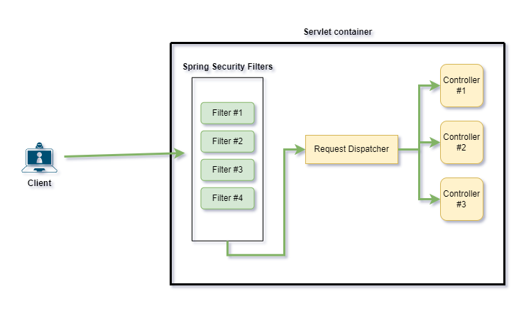
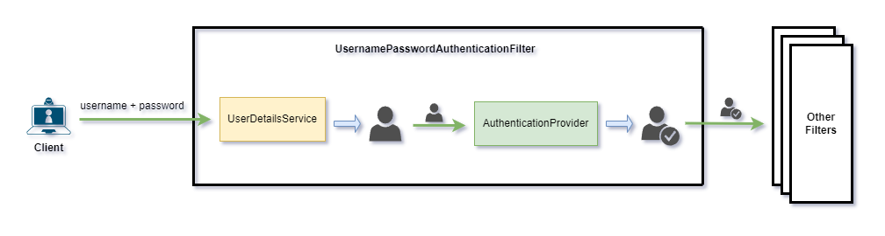
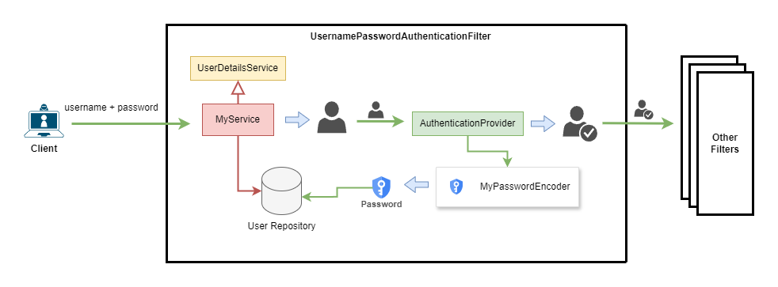

# Áp dụng custom Filter Chain cho Spring Security

Theo mặc định, khi cài đặt Spring Security sẽ tự động thêm một số lớp **Filter Chain** của nó, khiến cho mọi request đến controller đều bị chặn.



Để override hành động này, chúng ta sẽ cần định nghĩa một Bean có kiểu dữ liệu **SecurityFilterChain**, từ đó cho phép chúng ta tự thiết lập chuỗi security của riêng mình.

```java
package nlu.com.app.configuration;

import org.springframework.context.annotation.Bean;
import org.springframework.context.annotation.Configuration;
import org.springframework.security.config.annotation.web.builders.HttpSecurity;
import org.springframework.security.config.annotation.web.configuration.EnableWebSecurity;
import org.springframework.security.web.SecurityFilterChain;

@Configuration
@EnableWebSecurity
public class SecurityConfiguration {
    @Bean
    public SecurityFilterChain configure(HttpSecurity http) throws Exception {
        return http.csrf(customizer -> customizer.disable())
                .authorizeHttpRequests(request -> request.anyRequest().authenticated())
                .httpBasic(Customizer.withDefaults())
                .sessionManagement(session -> session.sessionCreationPolicy(SessionCreationPolicy.STATELESS))
                .build();
    }
}
```
- Đoạn code này giúp định nghĩa lại chuỗi luật sẽ áp dụng.

## UsernamePasswordAuthenticationFilter
Một trong các filter mà ta cần chú ý trong Spring Security là **UsernamePasswordAuthenticationFilter** vì filter này cho phép định nghĩa logic sẽ được sử dụng cho giao thức bảo mật bằng username và password thông thường.

### UserDetailsService
Spring Security có một interface **UserDetailsService** được viết sẵn cung cấp các hàm để tải thông tin user.

- Chúng ta sẽ muốn implement lại interface này, vì chúng ta sẽ cần nó sử dụng thông tin user có trong database của hệ thống thay để thực hiện xác thực.
- Có thể định nghĩa một bean mới cung cấp **UserDetailsService** để override lại service này.

### AuthenticationManager
**AuthenticationManager** là thành phần trung tâm của Spring Security, nó không trực tiếp thực hiện quá trình xác thực người dùng mà sẽ quản lý và ủy quyền cho các thành phần khác.

### AuthenticationProvider
Về cơ bản thì để **UsernamePasswordAuthenticationFilter** có thể thực hiện xác minh, thì nó cần đến **AuthenticationProvider**



1. Người dùng sẽ gửi tài khoản và mật khẩu đến hệ thống. Tại **UsernamePasswordAuthenticationFilter**, thông tin tài khoản và mật khẩu sẽ được chuyển đổi thành một đối tượng để xử lý (thường là **UsernamePasswordAuthenticationToken**)
2. Token sau khi được tạo xong sẽ được gửi đến **AuthenticationManager**.
3. **AuthenticationManager** không tự xử lý thông tin trong Token, mà sẽ gửi Token cho **AuthenticationProvider** để xử lý.
4. **AuthenticationProvider** sau khi có được token, sẽ sử dụng **UserDetailsService** để thực hiện load thông tin user.
5. Sau khi nhận kết quả truy vấn từ service, **AuthenticationProvider** thực hiện xác thực thông tin đăng nhập, so sánh mật khẩu và các kiểm tra cần thiết khác, nếu thông tin hợp lệ thì sẽ cho ra một đối tượng **Authentication** đã được xác thực.
6. **Authentication được xác thực** sẽ được trả về cho **AuthenticationManager**.
7. **AuthenticationManager** sau khi có được kết quả sẽ trả về đối tượng xác thực cho lớp Servlet khác (có thể là một tầng Filter khác hoặc cái Servlet sâu hơn bên dưới).
8. Sau khi hoàn tất quá trình xác thực và trải qua toàn bộ các bước cần thiết khác, một HttpSession tương ứng sẽ được tạo ra trong hệ thống.
9. Cuối cùng, hệ thống trả về sessionId tương ứng với session đã tạo cho người dùng.

Như vậy, để implement được một logic xác thực bằng tài khoản & mật khẩu cho hệ thống back-end, chúng ta cần thiết lập lại tại **UserDetailsService** và **AuthenticationProvider**.



- **AuthenticationManager** sẽ sử dụng **MyProvider** mà chúng ta cung cấp thay vì mặc định.
- **MyProvider** sẽ hiện thực lại **AuthenticationProvider** nhằm định nghĩa lại phương thức **authenticate()**, cho phép viết các logic xác thực phù hợp với nhu cầu
  - Định nghĩa lại PasswordEncoder sẽ sử dụng.
  - Định nghĩa lại logic xử lý authenticate, có thể là dựa vào nhiều thông tin hơn là chỉ username và password.
  - Sử dụng service tự tạo thay vì **UserServiceDetails**
- **MyService** sẽ hiện thực lại **UserDetailsService**, cho phép chúng ta viết lại logic truy vấn người dùng:
  - Để thực hiện truy vấn, service này sẽ gọi đến **User Repository** để load thông tin người dùng từ database.

Ngoài ra, cần tạo thêm một lớp để chứa thông tin xác thực của người dùng sau khi thực hiện truy vấn, lớp này cần implement lại interface **UserDetails**.

```java
package nlu.com.app.entity;

import org.springframework.security.core.GrantedAuthority;
import org.springframework.security.core.authority.SimpleGrantedAuthority;
import org.springframework.security.core.userdetails.UserDetails;

import java.util.Collection;
import java.util.List;

public class UserPrincipal implements UserDetails {
    private final User user;

    public UserPrincipal(User user) {
        this.user = user;
    }

    @Override
    public Collection<? extends GrantedAuthority> getAuthorities() {
        return List.of(new SimpleGrantedAuthority(user.getRole().name()));
    }

    @Override
    public String getPassword() {
        return user.getPassword();
    }

    @Override
    public String getUsername() {
        return user.getUsername();
    }

    @Override
    public boolean isAccountNonExpired() {
        return true;
    }

    @Override
    public boolean isAccountNonLocked() {
        return true;
    }

    @Override
    public boolean isCredentialsNonExpired() {
        return true;
    }

    @Override
    public boolean isEnabled() {
        return true;
    }
}
```

Tiếp theo, cần tạo một lớp implement lại UserDetailsService, lớp này sẽ truy vấn thông tin đăng nhập được lưu trên database sau đó trả về đối tượng xác thực chứa thông tin đó.

```java
package nlu.com.app.security;

import lombok.RequiredArgsConstructor;
import nlu.com.app.entity.User;
import nlu.com.app.repository.UserRepository;
import org.springframework.security.core.userdetails.UserDetails;
import org.springframework.security.core.userdetails.UserDetailsService;
import org.springframework.security.core.userdetails.UsernameNotFoundException;

@RequiredArgsConstructor
public class CustomUserDetailsService implements UserDetailsService {
    private final UserRepository userRepository;
    @Override
    public UserDetails loadUserByUsername(String username) throws UsernameNotFoundException {
        User user = userRepository.findByUsername(username)
                .orElseThrow(() -> new UsernameNotFoundException(username));
        return new UserPrincipal(user);
    }
}
```

Sau đó, tạo lớp hiện thực lại **AuthenticationProvider** để định nghĩa quá trình xác thực thông tin đăng nhập.

```java
package nlu.com.app.security;

import lombok.RequiredArgsConstructor;
import org.springframework.security.authentication.AuthenticationProvider;
import org.springframework.security.authentication.BadCredentialsException;
import org.springframework.security.authentication.UsernamePasswordAuthenticationToken;
import org.springframework.security.core.Authentication;
import org.springframework.security.core.AuthenticationException;
import org.springframework.security.core.userdetails.UserDetails;
import org.springframework.security.crypto.password.PasswordEncoder;
import org.springframework.stereotype.Component;

@Component
@RequiredArgsConstructor
public class CustomAuthenticationProvider implements AuthenticationProvider {
    private final CustomUserDetailsService service;
    private final PasswordEncoder encoder;

    @Override
    public Authentication authenticate(Authentication authentication) throws AuthenticationException {
        String username = authentication.getName();
        String password = authentication.getCredentials().toString();

        UserDetails userDetails = service.loadUserByUsername(username);

        if (!encoder.matches(password, userDetails.getPassword())) {
            throw new BadCredentialsException("Invalid password");
        }

        return new UsernamePasswordAuthenticationToken(userDetails, password, userDetails.getAuthorities());
    }

    @Override
    public boolean supports(Class<?> authentication) {
        return authentication.equals(UsernamePasswordAuthenticationToken.class);
    }
}
```

Cuối cùng, ta đăng ký **AuthenticationProvider** vừa tạo với **AuthenticationManager**

```java
package nlu.com.app.configuration;

import lombok.RequiredArgsConstructor;
import nlu.com.app.security.CustomAuthenticationProvider;
import org.springframework.context.annotation.Bean;
import org.springframework.context.annotation.Configuration;
import org.springframework.security.authentication.AuthenticationManager;
import org.springframework.security.authentication.ProviderManager;
import org.springframework.security.config.Customizer;
import org.springframework.security.config.annotation.web.builders.HttpSecurity;
import org.springframework.security.config.annotation.web.configuration.EnableWebSecurity;
import org.springframework.security.config.http.SessionCreationPolicy;
import org.springframework.security.crypto.bcrypt.BCryptPasswordEncoder;
import org.springframework.security.crypto.password.PasswordEncoder;
import org.springframework.security.web.SecurityFilterChain;

import java.util.List;

@Configuration
@EnableWebSecurity
@RequiredArgsConstructor
public class SecurityConfiguration {
    private final CustomAuthenticationProvider customAuthenticationProvider;

    @Bean
    public AuthenticationManager authenticationManager() {
        return new ProviderManager(List.of(customAuthenticationProvider));
    }

    @Bean
    public SecurityFilterChain configure(HttpSecurity http) throws Exception {
        return http.csrf(customizer -> customizer.disable())
                .authorizeHttpRequests(request -> request.anyRequest().authenticated())
                .formLogin(form -> form.loginPage("/login"))
                .sessionManagement(session -> session.sessionCreationPolicy(SessionCreationPolicy.STATELESS))
                .build();
    }

    @Bean
    public PasswordEncoder passwordEncoder() {
        return new BCryptPasswordEncoder(16);
    }
}
```

#