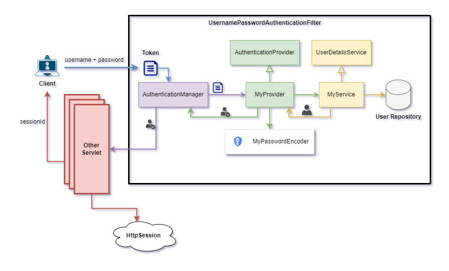

# Áp dụng custom Filter Chain cho Spring Security

Theo mặc định, khi cài đặt Spring Security sẽ tự động thêm một số lớp **Filter Chain** của nó, khiến cho mọi request đến controller đều bị chặn.


Để override hành động này, chúng ta sẽ cần định nghĩa một Bean có kiểu dữ liệu **SecurityFilterChain**, từ đó cho phép chúng ta tự thiết lập chuỗi security của riêng mình.

```java
package nlu.com.app.configuration;

import org.springframework.context.annotation.Bean;
import org.springframework.context.annotation.Configuration;
import org.springframework.security.config.annotation.web.builders.HttpSecurity;
import org.springframework.security.config.annotation.web.configuration.EnableWebSecurity;
import org.springframework.security.web.SecurityFilterChain;

@Configuration
@EnableWebSecurity
public class SecurityConfiguration {
    @Bean
    public SecurityFilterChain configure(HttpSecurity http) throws Exception {
        return http.csrf(customizer -> customizer.disable())
                .authorizeHttpRequests(request -> request.anyRequest().authenticated())
                .httpBasic(Customizer.withDefaults())
                .sessionManagement(session -> session.sessionCreationPolicy(SessionCreationPolicy.STATELESS))
                .build();
    }
}
```
- Đoạn code này giúp định nghĩa lại chuỗi luật sẽ áp dụng.

## UsernamePasswordAuthenticationFilter
Một trong các filter mà ta cần chú ý trong Spring Security là **UsernamePasswordAuthenticationFilter** vì filter này cho phép định nghĩa logic sẽ được sử dụng cho giao thức bảo mật bằng username và password thông thường.

### UserDetailsService
Spring Security có một interface **UserDetailsService** được viết sẵn cung cấp các hàm để tải thông tin user.

- Chúng ta sẽ muốn implement lại interface này, vì chúng ta sẽ cần nó sử dụng thông tin user có trong database của hệ thống thay để thực hiện xác thực.
- Có thể định nghĩa một bean mới cung cấp **UserDetailsService** để override lại service này.

### AuthenticationProvider
Về cơ bản thì để **UsernamePasswordAuthenticationFilter** có thể thực hiện xác minh, thì nó cần đến **AuthenticationProvider**


- Người dùng sẽ gửi tài khoản, mật khẩu của họ đến hệ thống.
- Servlet Filter sẽ yêu cầu **UserDetailsService** truy vấn hay load thông tin đăng nhập dựa vào tài khoản và mật khẩu đã nhận, tạo ra một đối tượng **Authentication chưa xác thực**.
- Đối tượng **Authentication chưa xác thực** này sẽ được gửi đến **AuthenticationProvider** để kiểm tra, nếu thành công thì sẽ trở thành đối tượng **Authentication đã xác thực**.
- Tại đây, Filter đã xem là request đã được xác thực và có thể vượt qua.
- Đối tượng **Authentication** sau đó sẽ được gửi theo request đến các filter khác nếu cần thiết.

Như vậy, để implement được một logic xác thực bằng tài khoản & mật khẩu cho hệ thống back-end, chúng ta cần thiết lập lại tại **UserDetailsService** và **AuthenticationProvider**.



- Tạo một lớp để hiện thực lại **UserDetailsService**, tại lớp này chúng ta viết logic truy vấn thông tin user trên repository dựa vào username.
- Sau khi truy vấn xong, tạo ra đối tượng cần thiết để giữ các thông tin sẽ dùng để xác thực.
- Tại **AuthenticationProvider**, có thể thiết lập một PasswordEncoder phù hợp với nhu cầu để thực hiện mã hóa mật khẩu.
- Sử dụng mật khẩu đã được mã hóa để so sánh với mật khẩu trên database để xác thực quá trình đăng nhập.