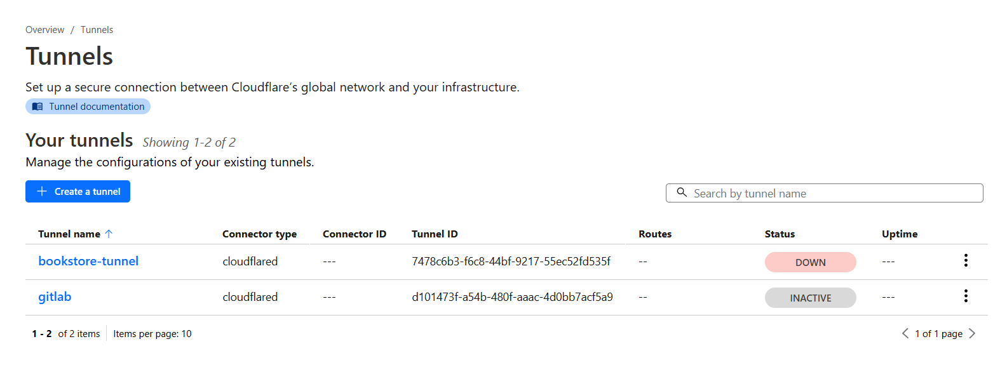
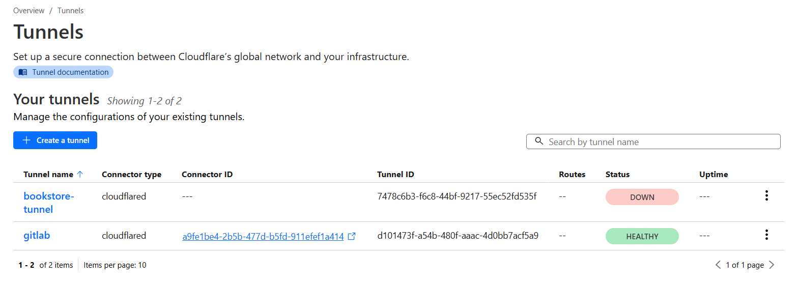
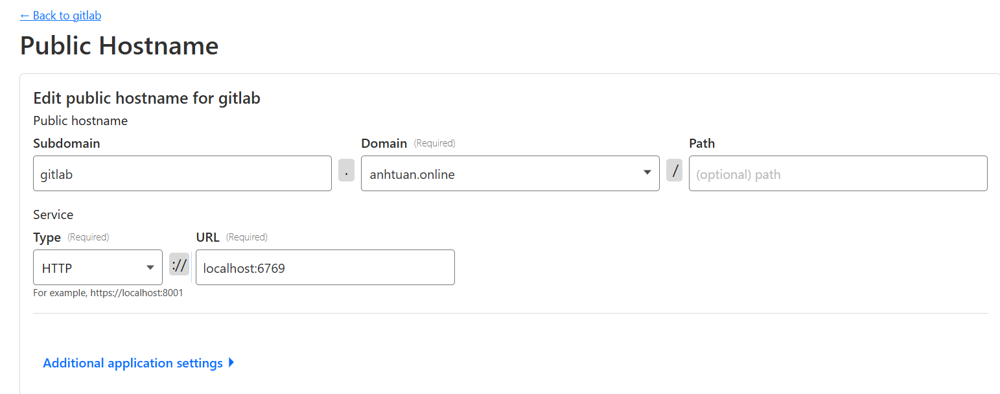
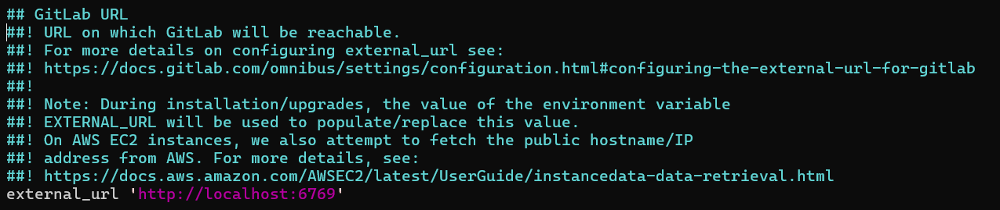
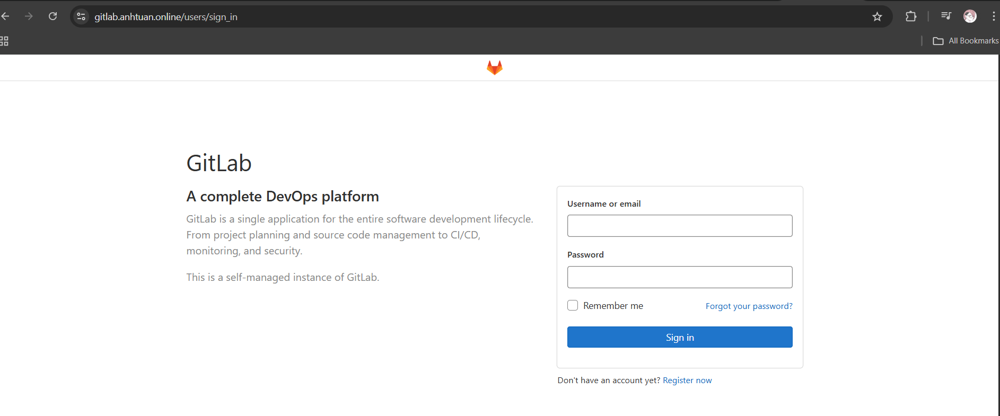
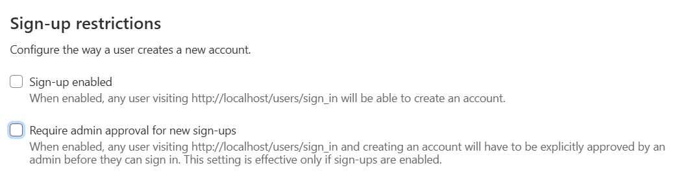
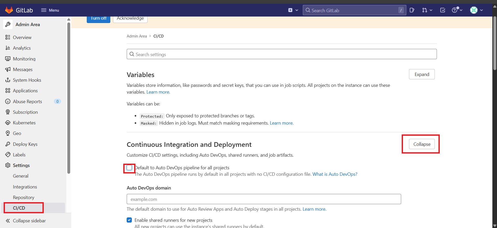
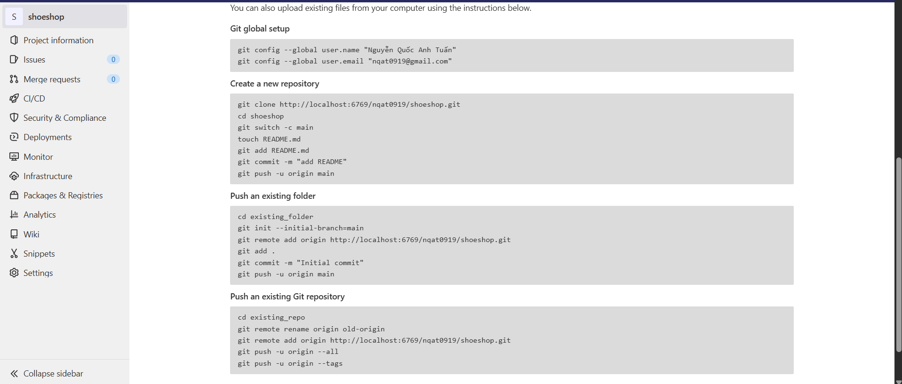
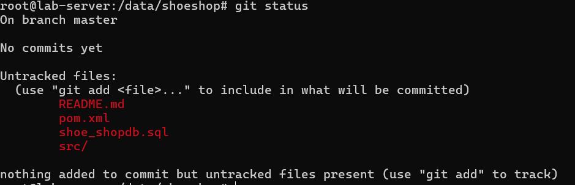

# Gitlab
Trong thực tế, các doanh nghiệp thường tự quản lý mã nguồn bằng GitLab chứ không phải qua Github.

Để học DevOps, thì kĩ năng sử dụng và thiết lập một máy chủ GitLab là rất cần thiết.

## Cách thiết lập một server Gitlab
### Chuẩn bị
Chúng ta cần chuẩn bị ít nhất hai máy ảo: **dev-server** và **lab-server**.

Để thuận tiện thao tác, ta có thể đổi tên server tại file `/etc/hostname`

Ngoài ra, chúng ta sẽ muốn đảm bảo rằng hai máy ảo này chung một mạng nhưng khác địa chỉ IP.

#### Cài đặt Gitlab

Để bắt đầu, chúng ta sẽ cài đặt gitlab cho **lab-server**, có thể search một bản [tại đây](https://packages.gitlab.com/gitlab/gitlab-ee)

Giả sử bản của chúng ta chọn sẽ là **gitlab-ee_14.10.5-ee.0_arm64.deb** dành cho distribution ubuntu.

Để cài đặt thì theo trang chủ hướng dẫn, chúng ta cần thêm repository của gitlab vào apt bằng lệnh

```shell
root@lab-server:~# curl -s https://packages.gitlab.com/install/repositories/gitlab/gitlab-ee/script.deb.sh | sudo bash
```

- Tải xuống script shell từ GitLab.
- Chuyển hướng output của script shell vào một bash mới để thực thi với quyền root.
- Script shell sẽ: 

  - Thêm repository GitLab EE vào danh sách nguồn APT.
  - Cấu hình GPG key để xác thực gói cài đặt GitLab EE.
  - Cập nhật danh sách gói APT.

Sau khi cập nhật xong repository gitlab vào apt, có thể cài đặt gói gitlab-ee bằng lệnh:

```shell
root@lab-server:~# sudo apt-get install gitlab-ee=14.10.5-ee.0
```

#### Thiết lập Gitlab

##### Thiết lập domain
Thông thường, server gitlab sẽ được định danh bằng một domain cụ thể, chúng ta có thể "mô phỏng" hành vi này bằng cách add host trên **dev-server** để nó có thể gọi đến **lab-server** qua một domain.

Nhưng trường hợp ta đã có domain, ta có thể sử dụng phương pháp cloudflare tunnel, cho phép cloudflare chuyển hướng request đến máy ảo mà không yêu cầu ta phải mở thêm cổng, ngoài ra máy ảo hoàn toàn có thể thay đổi địa chỉ IP tùy ý trong quá trình này.

###### Tạo một tunnel trên cloudflare



###### Tải tunnel này về máy ảo để tiến hành thiết lập

```shell
curl -L --output cloudflared.deb https://github.com/cloudflare/cloudflared/releases/latest/download/cloudflared-linux-amd64.deb && 

sudo dpkg -i cloudflared.deb && 

sudo cloudflared service install <API_TOKEN_CỦA_BẠN>
```
- Lệnh **curl** sẽ tải xuống gói cài đặt **.deb** của Cloudflare Tunnel dành cho Linux  
  - flag **-L** cho phép tự động chuyển hướng URL nếu URL chuyển hướng đến một địa chỉ khác.
  - flag **--output** đặt lại tên gói là **cloudflared.deb**.
- Lệnh **dpkg -i** sẽ cài đặt gói vừa tải xuống.
- **cloudflared service install** Lệnh này sẽ cài đặt cloudflared dưới dạng một dịch vụ hệ thống (service) với systemd. Điều này cho phép bạn khởi động và dừng cloudflared dễ dàng, cũng như tự động chạy khi hệ thống khởi động.

Sau khi cài đặt xong thì tunnel sẽ HEALTHY:



###### Thêm Public Hostname cho Tunnel

Tiếp theo, chúng ta bấm vào Tunnel và qua tab **Public Hostname** để thiết lập một hostname dành cho tunnel này. Hostname này sẽ dùng để truy cập đến Gitlab trong máy ảo.



Như vậy đã thiết lập xong tunnel đến http://localhost:6769 trong máy ảo, tiếp theo ta cần đảm bảo gitlab sẽ serve tại port này, config tại:

```shell
root@lab-server:~# vi /etc/gitlab/gitlab.rb
```



Sau đó:

```shell
root@lab-server:~# gitlab-ctl reconfigure
```

Cuối cùng, để tránh DNS lỗi bị cache lại, **Win + R** rồi nhập **ipconfig /flushdns**

Nếu thành công thì gitlab sẽ được phục vụ tại địa chỉ: https://gitlab.anhtuan.online/



Để đăng nhập vào gitlab chúng ta sử dụng user root với mật khẩu mặc định trong file **/etc/gitlab/initial_root_password**

Tiếp theo, cần disable tạo mới user



Tiếp theo, bỏ phần auto devops trong **CI/CD**



Để best practice thì, nên tạo một user mới có quyền admin rồi sử dụng user đó chứ không dùng user root.

## Sử dụng GitLab

Về cơ bản thì Gitlab cũng giống như Github, mỗi một project sẽ có một Repository riêng, giả sử chúng ta muốn tạo dự án [shoes shop](../devops/devops-1.md#back-end-springboot-app---shoeshop), chúng ta cũng sẽ tạo một folder (repository) cho dự án đó trên gitlab.


Sau khi tạo dự án xong thì cũng sẽ có các bước để bắt đầu dự án



```shell
root@lab-server:~# git config --global user.name "Nguyễn Quốc Anh Tuấn"
root@lab-server:~# git config --global user.email "nqat0919@gmail.com"
root@lab-server:~# mkdir /data && cd /data && git clone http://localhost:6769/nqat0919/shoeshop.git
Cloning into 'shoeshop'...
Username for 'http://localhost:6769': nqat0919
Password for 'http://nqat0919@localhost:6769':
warning: You appear to have cloned an empty repository.
root@lab-server:/data# cd shoeshop
```

Bây giờ, tiến hành copy source code của dự án shoeshop vào thư mục này, cách chuẩn bị dự án [đã được trình bày trước đó](../devops/devops-1.md#back-end-springboot-app---shoeshop)

```shell
root@lab-server:/data/shoeshop# cp /projects/shoeshop/* /data/shoeshop/
root@lab-server:/data/shoeshop# ls
pom.xml  README.md  shoe_shopdb.sql  src
```
Khi kiểm tra thử thì thấy chúng ta đang ở nhánh master/



Có thể tạo mới và chuyển sang nhánh main:

```shell
root@lab-server:/data/shoeshop# git checkout -b main
Switched to a new branch 'main'
```

Tương tự Github, lúc này chúng ta có thể commmit và push dự án lên với các lệnh quen thuộc.