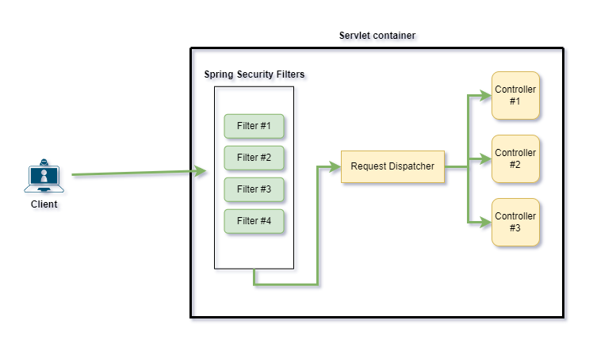
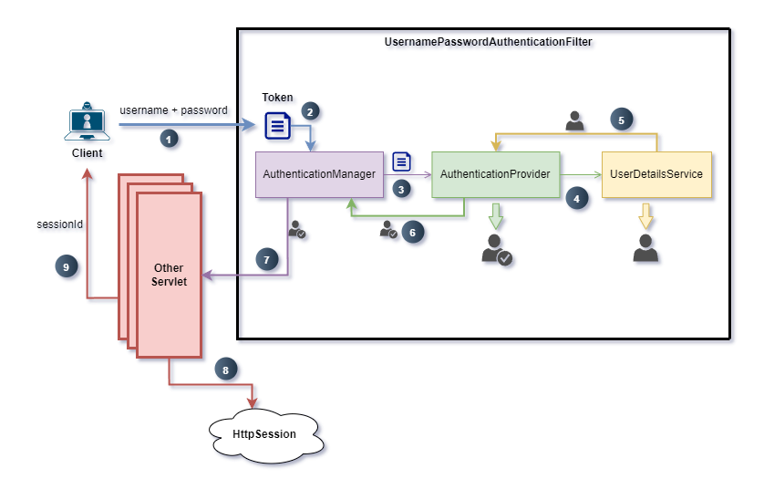
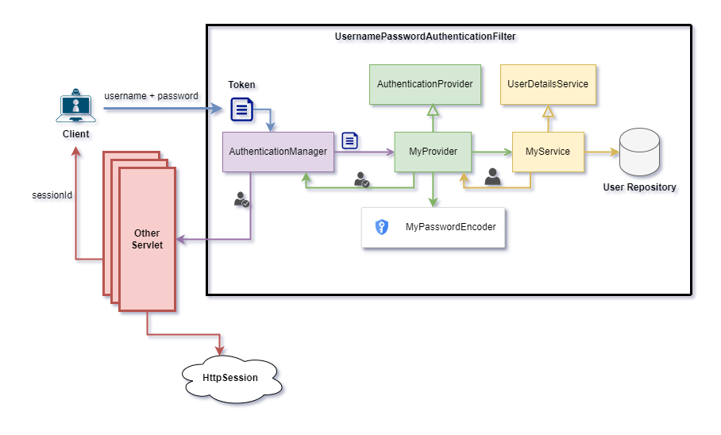
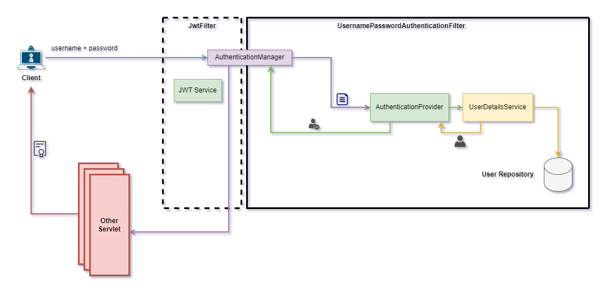
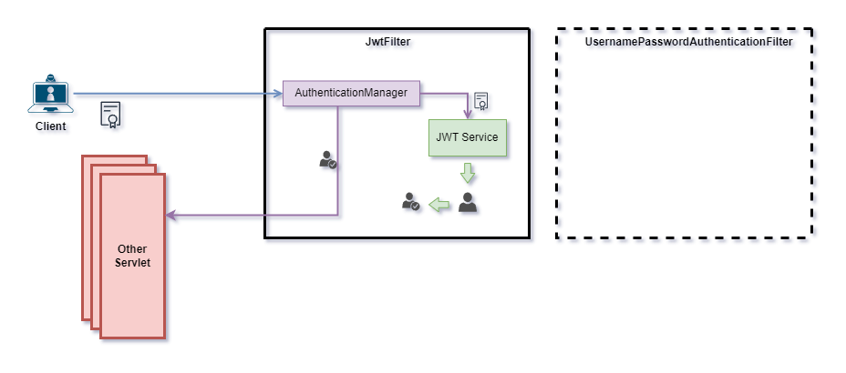

# Áp dụng custom Filter Chain cho Spring Security

Theo mặc định, khi cài đặt Spring Security sẽ tự động thêm một số lớp **Filter Chain** của nó, khiến cho mọi request đến controller đều bị chặn.



Để override hành động này, chúng ta sẽ cần định nghĩa một Bean có kiểu dữ liệu **SecurityFilterChain**, từ đó cho phép chúng ta tự thiết lập chuỗi security của riêng mình.

```java
package nlu.com.app.configuration;

import org.springframework.context.annotation.Bean;
import org.springframework.context.annotation.Configuration;
import org.springframework.security.config.annotation.web.builders.HttpSecurity;
import org.springframework.security.config.annotation.web.configuration.EnableWebSecurity;
import org.springframework.security.web.SecurityFilterChain;

@Configuration
@EnableWebSecurity
public class SecurityConfiguration {
    @Bean
    public SecurityFilterChain configure(HttpSecurity http) throws Exception {
        return http.csrf(customizer -> customizer.disable())
                .authorizeHttpRequests(request -> request.anyRequest().authenticated())
                .httpBasic(Customizer.withDefaults())
                .sessionManagement(session -> session.sessionCreationPolicy(SessionCreationPolicy.STATELESS))
                .build();
    }
}
```
- Đoạn code này giúp định nghĩa lại chuỗi luật sẽ áp dụng.

## UsernamePasswordAuthenticationFilter
Một trong các filter mà ta cần chú ý trong Spring Security là **UsernamePasswordAuthenticationFilter** vì filter này cho phép định nghĩa logic sẽ được sử dụng cho giao thức bảo mật bằng username và password thông thường.

### UserDetailsService
Spring Security có một interface **UserDetailsService** được viết sẵn cung cấp các hàm để tải thông tin user.

- Chúng ta sẽ muốn implement lại interface này, vì chúng ta sẽ cần nó sử dụng thông tin user có trong database của hệ thống thay để thực hiện xác thực.
- Có thể định nghĩa một bean mới cung cấp **UserDetailsService** để override lại service này.

### AuthenticationManager
**AuthenticationManager** là thành phần trung tâm của Spring Security, nó không trực tiếp thực hiện quá trình xác thực người dùng mà sẽ quản lý và ủy quyền cho các thành phần khác.

### AuthenticationProvider
Về cơ bản thì để **UsernamePasswordAuthenticationFilter** có thể thực hiện xác minh, thì nó cần đến **AuthenticationProvider**



1. Người dùng sẽ gửi tài khoản và mật khẩu đến hệ thống. Tại **UsernamePasswordAuthenticationFilter**, thông tin tài khoản và mật khẩu sẽ được chuyển đổi thành một đối tượng để xử lý (thường là **UsernamePasswordAuthenticationToken**)
2. Token sau khi được tạo xong sẽ được gửi đến **AuthenticationManager**.
3. **AuthenticationManager** không tự xử lý thông tin trong Token, mà sẽ gửi Token cho **AuthenticationProvider** để xử lý.
4. **AuthenticationProvider** sau khi có được token, sẽ sử dụng **UserDetailsService** để thực hiện load thông tin user.
5. Sau khi nhận kết quả truy vấn từ service, **AuthenticationProvider** thực hiện xác thực thông tin đăng nhập, so sánh mật khẩu và các kiểm tra cần thiết khác, nếu thông tin hợp lệ thì sẽ cho ra một đối tượng **Authentication** đã được xác thực.
6. **Authentication được xác thực** sẽ được trả về cho **AuthenticationManager**.
7. **AuthenticationManager** sau khi có được kết quả sẽ trả về đối tượng xác thực cho lớp Servlet khác (có thể là một tầng Filter khác hoặc cái Servlet sâu hơn bên dưới).
8. Sau khi hoàn tất quá trình xác thực và trải qua toàn bộ các bước cần thiết khác, một HttpSession tương ứng sẽ được tạo ra trong hệ thống.
9. Cuối cùng, hệ thống trả về sessionId tương ứng với session đã tạo cho người dùng.

Như vậy, để implement được một logic xác thực bằng tài khoản & mật khẩu cho hệ thống back-end, chúng ta cần thiết lập lại tại **UserDetailsService** và **AuthenticationProvider**.



- **AuthenticationManager** sẽ sử dụng **MyProvider** mà chúng ta cung cấp thay vì mặc định.
- **MyProvider** sẽ hiện thực lại **AuthenticationProvider** nhằm định nghĩa lại phương thức **authenticate()**, cho phép viết các logic xác thực phù hợp với nhu cầu
  - Định nghĩa lại PasswordEncoder sẽ sử dụng.
  - Định nghĩa lại logic xử lý authenticate, có thể là dựa vào nhiều thông tin hơn là chỉ username và password.
  - Sử dụng service tự tạo thay vì **UserServiceDetails**
- **MyService** sẽ hiện thực lại **UserDetailsService**, cho phép chúng ta viết lại logic truy vấn người dùng:
  - Để thực hiện truy vấn, service này sẽ gọi đến **User Repository** để load thông tin người dùng từ database.

Ngoài ra, cần tạo thêm một lớp để chứa thông tin xác thực của người dùng sau khi thực hiện truy vấn, lớp này cần implement lại interface **UserDetails**.

```java
package nlu.com.app.entity;

import org.springframework.security.core.GrantedAuthority;
import org.springframework.security.core.authority.SimpleGrantedAuthority;
import org.springframework.security.core.userdetails.UserDetails;

import java.util.Collection;
import java.util.List;

public class UserPrincipal implements UserDetails {
    private final User user;

    public UserPrincipal(User user) {
        this.user = user;
    }

    @Override
    public Collection<? extends GrantedAuthority> getAuthorities() {
        return List.of(new SimpleGrantedAuthority(user.getRole().name()));
    }

    @Override
    public String getPassword() {
        return user.getPassword();
    }

    @Override
    public String getUsername() {
        return user.getUsername();
    }

    @Override
    public boolean isAccountNonExpired() {
        return true;
    }

    @Override
    public boolean isAccountNonLocked() {
        return true;
    }

    @Override
    public boolean isCredentialsNonExpired() {
        return true;
    }

    @Override
    public boolean isEnabled() {
        return true;
    }
}
```

Tiếp theo, cần tạo một lớp implement lại UserDetailsService, lớp này sẽ truy vấn thông tin đăng nhập được lưu trên database sau đó trả về đối tượng xác thực chứa thông tin đó.

```java
package nlu.com.app.security;

import lombok.RequiredArgsConstructor;
import nlu.com.app.entity.User;
import nlu.com.app.repository.UserRepository;
import org.springframework.security.core.userdetails.UserDetails;
import org.springframework.security.core.userdetails.UserDetailsService;
import org.springframework.security.core.userdetails.UsernameNotFoundException;

@RequiredArgsConstructor
public class CustomUserDetailsService implements UserDetailsService {
    private final UserRepository userRepository;
    @Override
    public UserDetails loadUserByUsername(String username) throws UsernameNotFoundException {
        User user = userRepository.findByUsername(username)
                .orElseThrow(() -> new UsernameNotFoundException(username));
        return new UserPrincipal(user);
    }
}
```

Sau đó, tạo lớp hiện thực lại **AuthenticationProvider** để định nghĩa quá trình xác thực thông tin đăng nhập.

```java
package nlu.com.app.security;

import lombok.RequiredArgsConstructor;
import org.springframework.security.authentication.AuthenticationProvider;
import org.springframework.security.authentication.BadCredentialsException;
import org.springframework.security.authentication.UsernamePasswordAuthenticationToken;
import org.springframework.security.core.Authentication;
import org.springframework.security.core.AuthenticationException;
import org.springframework.security.core.userdetails.UserDetails;
import org.springframework.security.crypto.password.PasswordEncoder;
import org.springframework.stereotype.Component;

@Component
@RequiredArgsConstructor
public class CustomAuthenticationProvider implements AuthenticationProvider {
    private final CustomUserDetailsService service;
    private final PasswordEncoder encoder;

    @Override
    public Authentication authenticate(Authentication authentication) throws AuthenticationException {
        String username = authentication.getName();
        String password = authentication.getCredentials().toString();

        UserDetails userDetails = service.loadUserByUsername(username);

        if (!encoder.matches(password, userDetails.getPassword())) {
            throw new BadCredentialsException("Invalid password");
        }

        return new UsernamePasswordAuthenticationToken(userDetails, password, userDetails.getAuthorities());
    }

    @Override
    public boolean supports(Class<?> authentication) {
        return authentication.equals(UsernamePasswordAuthenticationToken.class);
    }
}
```

Cuối cùng, ta đăng ký **AuthenticationProvider** vừa tạo với **AuthenticationManager**

```java
package nlu.com.app.configuration;

import lombok.RequiredArgsConstructor;
import nlu.com.app.security.CustomAuthenticationProvider;
import org.springframework.context.annotation.Bean;
import org.springframework.context.annotation.Configuration;
import org.springframework.security.authentication.AuthenticationManager;
import org.springframework.security.authentication.ProviderManager;
import org.springframework.security.config.Customizer;
import org.springframework.security.config.annotation.web.builders.HttpSecurity;
import org.springframework.security.config.annotation.web.configuration.EnableWebSecurity;
import org.springframework.security.config.http.SessionCreationPolicy;
import org.springframework.security.crypto.bcrypt.BCryptPasswordEncoder;
import org.springframework.security.crypto.password.PasswordEncoder;
import org.springframework.security.web.SecurityFilterChain;

import java.util.List;

@Configuration
@EnableWebSecurity
@RequiredArgsConstructor
public class SecurityConfiguration {
    private final CustomAuthenticationProvider customAuthenticationProvider;

    @Bean
    public AuthenticationManager authenticationManager() {
        return new ProviderManager(List.of(customAuthenticationProvider));
    }

    @Bean
    public SecurityFilterChain configure(HttpSecurity http) throws Exception {
        return http.csrf(customizer -> customizer.disable())
                .authorizeHttpRequests(request -> request.anyRequest().authenticated())
                .formLogin(form -> form.loginPage("/login"))
                .sessionManagement(session -> session.sessionCreationPolicy(SessionCreationPolicy.IF_REQUIRED))
                .build();
    }
}
```

# Sử dụng JWT làm cơ chế xác thực
## Phân biệt Stateful và Stateless
### Lưu trữ trạng thái

**Stateful**
- **Trạng thái lưu trên server**: Mỗi lần người dùng đăng nhập, server tạo một phiên làm việc (session) và lưu trữ thông tin người dùng trong bộ nhớ (hoặc database, Redis,...).
- **Session ID**: Client nhận được session ID (thường được lưu qua cookie) và gửi lại trong các request để server nhận diện phiên làm việc.
- **Phụ thuộc vào server**: Nếu session được lưu trong bộ nhớ của một server cụ thể, cần có cơ chế chia sẻ (sticky session hoặc session replication) khi triển khai trên nhiều server.

**Stateless**
- **Không lưu trữ trạng thái trên server**: Thông tin đăng nhập (user identity, quyền hạn,...) được mã hóa vào một token, và client lưu trữ token này (trong local storage, cookie, hoặc header).
- **Token tự chứa thông tin**: Mỗi request từ client kèm token, server chỉ cần kiểm tra tính hợp lệ của token (thông qua chữ ký) để xác thực.
- **Tự mở rộng dễ dàng**: Không phụ thuộc vào session storage trên server, do đó dễ scale theo số lượng request và triển khai trên nhiều server.

### Cơ chế xác thực

**Stateful**
- **Authentication ban đầu**: Khi người dùng đăng nhập, username/password được xác thực và thông tin user được lưu vào session.
- **Lấy thông tin từ session**: Các request sau đó chỉ cần dựa vào session ID để xác thực, không cần kiểm tra lại username/password mỗi lần.
- **Logout**: Khi logout, server sẽ xóa session khỏi bộ nhớ.

**Stateless**
- **Authentication ban đầu**: Khi người dùng đăng nhập, hệ thống xác thực username/password và sinh ra token.
- **Xác thực token**: Các request sau đó kèm token trong header; server chỉ cần giải mã và kiểm tra chữ ký của token để xác thực người dùng.
- **Logout**: Vì token là stateless nên không có cơ chế hủy token tự động (trừ khi dùng blacklist, thay đổi secret, hoặc refresh token).

Nếu sử dụng JWT làm cơ chế xác thực, nghĩa là đang sử dụng **Stateless**, nên Spring Security sẽ không có session để tương tác.

## Áp dụng JWT cho hệ thống

Spring Security không cung cấp sẵn một cơ chế sinh JWT như một tính năng mặc định. Do đó để hiện thực thì chúng ta sẽ cần dùng đến một thư viện sinh JWT của bên thứ (JJWT, Auth0 Java JWT, vv...)

Chúng ta có thể tạo một lớp **JwtService** như là một service có nhiệm vụ sinh và giải mã các JWT Token.

```java
package nlu.com.app.service;
import io.jsonwebtoken.Claims;
import io.jsonwebtoken.Jwts;
import io.jsonwebtoken.io.Decoders;
import io.jsonwebtoken.security.Keys;
import nlu.com.app.entity.User;
import org.springframework.beans.factory.annotation.Value;
import org.springframework.security.core.userdetails.UserDetails;
import org.springframework.stereotype.Service;

import java.security.Key;
import java.util.Date;
import java.util.Map;
import java.util.function.Function;

@Service
public class JWTService {
    @Value("${app.jwt-key}")
    String jwtKey;
    public String generateToken(String user) {
        return Jwts.builder()
                .setClaims(Map.of())
                .setSubject(user)
                .setIssuedAt(new Date(System.currentTimeMillis()))
                .setExpiration(new Date(System.currentTimeMillis() + 60 * 60 * 30))
                .signWith(getKey())
                .compact();
    }

    private Key getKey() {
        byte[] keyBytes = Decoders.BASE64.decode(jwtKey);
        return Keys.hmacShaKeyFor(keyBytes);
    }

    public String extractUsername(String token) {
        return extractClaim(token, Claims::getSubject);
    }

    public boolean validateToken(String token, UserDetails userDetails) {
        final String username = extractUsername(token);
        return (username.equals(userDetails.getUsername())) && !isTokenExpired(token);
    }

    private boolean isTokenExpired(String token) {
        return extractClaim(token, Claims::getExpiration).before(new Date());
    }

    private <T> T extractClaim(String token, Function<Claims, T> claimsResolver) {
        final Claims claims = extractAllClaims(token);
        return claimsResolver.apply(claims);
    }

    private Claims extractAllClaims(String token) {
        return Jwts.parserBuilder()
                .setSigningKey(getKey())
                .build()
                .parseClaimsJws(token)
                .getBody();
    }
}
```

Flow login của người dùng sau khi chuyển sang xác minh bằng JWT:



- Ban đầu sẽ không có gì thay đổi, chỉ khác là thay vì tạo một HttpSession tương ứng cho người dùng, hệ thống sẽ trả về một chuỗi JWT cho người dùng thay vì sessionId.
- Lớp JwtFilter là một filter custom kế thừa lại **OncePerRequestFilter**, sẽ đứng trước **UsernamePasswordAuthenticationFilter**, nhưng tạm thời sẽ không hoạt động vì với lần đăng nhập đầu tiên thì người dùng chưa có JWT để xử lý.

> Trong Spring Security, **AuthenticationManager** được định nghĩa như một bean trung tâm. Chúng ta có thể expose nó cho nhiều Filter cùng sử dụng chứ nó không thuộc về một Filter cụ thể.

Trong trường hợp người dùng đã đăng nhập và có chuỗi JWT trong header:



- **UsernamePasswordAuthenticationFilter** không cần phải hoạt động vì người dùng đã đăng nhập trước đó. Nhưng vì vậy, chúng ta cần phải tự tay quản lý việc cấp quyền xác minh cho người dùng (gọi hàm authenticate() của **AuthenticationManager**).
- **JwtFilter** lúc này sẽ trích xuất chuỗi JWT trong header, sau đó đưa chuỗi JWT này cho **JWT Service**.
- **JWT Service** sẽ phân tích chuỗi JWT vừa nhận, lấy ra các claims cần thiết có chứa thông tin người dùng để tạo thành một đối tượng **UsernamePasswordAuthenticationToken** thủ công.
- Sau đó, **UsernamePasswordAuthenticationToken** vừa được tạo ra sẽ được **AuthenticationManager** xác thực bằng cách gọi hàm authenticate().

Như vậy, để áp dụng xác thực bằng JWT cho Spring Security, chúng ta cần thực hiện các thay đổi sau:
- Tạo một service để xử lý các tác vụ liên quan đến JWT.
- Tạo một filter **JwtFilter**, đặt nó đứng trước **UsernamePasswordAuthenticationFilter** 
- Expose một bean **AuthenticationManager** để có thể truy cập tại **JwtFilter**.
- Chỉnh sửa lại logic tại endpoint đăng nhập, trả ra chuỗi JWT thay vì sessionId.

Chúng ta đã tạo **JWT Service**, cho nên tiếp theo cần expose bean **AuthenticationManager** để cho phép custom filter có thể sử dụng:

```java
package nlu.com.app.configuration;
@Configuration
@EnableWebSecurity
@RequiredArgsConstructor
public class SecurityConfiguration {
    private final CustomAuthenticationProvider customAuthenticationProvider;
    private final JwtFilter jwtFilter;
    // other configs
    @Bean
    public AuthenticationManager customizer(AuthenticationConfiguration configuration) throws Exception {
        return configuration.getAuthenticationManager();
    }
}
```

Tạo JwtFilter để xử lý JWT trong request của người dùng:

```java
package nlu.com.app.security;

import jakarta.servlet.FilterChain;
import jakarta.servlet.ServletException;
import jakarta.servlet.http.HttpServletRequest;
import jakarta.servlet.http.HttpServletResponse;
import lombok.RequiredArgsConstructor;
import nlu.com.app.service.impl.JWTService;
import nlu.com.app.service.UserServiceTest;
import org.springframework.context.ApplicationContext;
import org.springframework.security.authentication.UsernamePasswordAuthenticationToken;
import org.springframework.security.core.context.SecurityContextHolder;
import org.springframework.security.core.userdetails.UserDetailsService;
import org.springframework.security.web.authentication.WebAuthenticationDetailsSource;
import org.springframework.stereotype.Component;
import org.springframework.web.filter.OncePerRequestFilter;

import java.io.IOException;

@Component
@RequiredArgsConstructor
public class JwtFilter extends OncePerRequestFilter {

  private final JWTService jwtService;
  private final ApplicationContext context;

  @Override
  protected void doFilterInternal(HttpServletRequest request, HttpServletResponse response,
      FilterChain filterChain) throws ServletException, IOException {
    String authHeader = request.getHeader("Authorization");
    String username = null;
    String token = authHeader != null
        && authHeader.startsWith("Bearer ") ? authHeader.substring(7) : null;
    if (token != null) {
      username = jwtService.extractUsername(token);
      var userDetails = context.getBean(UserDetailsService.class).loadUserByUsername(username);
      if (username != null && SecurityContextHolder.getContext().getAuthentication() == null) {
        if (jwtService.validateToken(token, userDetails)) {
          UsernamePasswordAuthenticationToken authenticationToken =
              new UsernamePasswordAuthenticationToken(userDetails, null,
                  userDetails.getAuthorities());
          authenticationToken.setDetails(
              new WebAuthenticationDetailsSource().buildDetails(request));
          SecurityContextHolder.getContext().setAuthentication(authenticationToken);
        }
      }
    }
    filterChain.doFilter(request, response);
  }
}
```

Cuối cùng, chỉnh sửa lại logic endpoint /login, trả về chuỗi JWT nếu đăng nhập thành công:

```java
package nlu.com.app.service;

import lombok.RequiredArgsConstructor;
import nlu.com.app.dto.request.LoginUserDTO;
import nlu.com.app.exception.ApplicationException;
import nlu.com.app.exception.ErrorCode;
import nlu.com.app.mapper.UserMapper;
import nlu.com.app.repository.UserRepository;
import nlu.com.app.service.impl.JWTService;
import org.springframework.security.authentication.AuthenticationManager;
import org.springframework.security.authentication.UsernamePasswordAuthenticationToken;
import org.springframework.security.crypto.password.PasswordEncoder;
import org.springframework.stereotype.Service;

@Service
@RequiredArgsConstructor
public class UserService {

  private final UserRepository userRepository;
  private final UserMapper userMapper;
  private final PasswordEncoder passwordEncoder;
  private final JWTService jwtService;
  private final AuthenticationManager authenticationManager;

  public String verify(LoginUserDTO requestDTO) {
    var authentication = authenticationManager.authenticate(
        new UsernamePasswordAuthenticationToken(requestDTO.getUsername(),
            requestDTO.getPassword()));
    if (authentication.isAuthenticated()) {
      return jwtService.generateToken(requestDTO.getUsername());
    } else {
      throw new ApplicationException(ErrorCode.USER_NOT_EXISTED);
    }
  }
}
```

