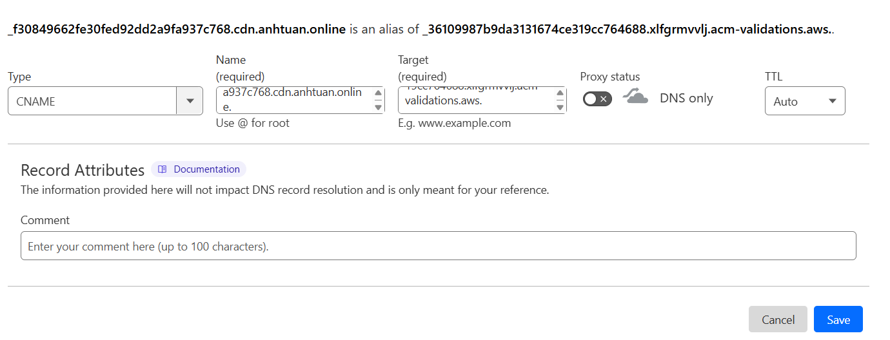

# Xây dựng hệ thống CDN cache S3 bằng Cloudfront kết hợp với Cloudflare

## Lý do sử dụng

Theo best practice, khi sử dụng Cloudflare làm CDN cho các file lưu trữ trên Amazon S3, nên kết hợp thêm CloudFront để đóng vai trò trung gian. Trong kiến trúc này:

- **CloudFront** sẽ làm nhiệm vụ CDN chính, cache nội dung từ S3.

- **Cloudflare** sẽ đóng vai trò reverse proxy, chuyển tiếp và cache nội dung từ **CloudFront**.

Cách triển khai này giúp Cloudflare có thể hoạt động trong chế độ bảo mật [**SSL Full (Strict)**](./ssl-with-cloudflare.md#chi-tiết-về-các-loại-ssl-của-cloudflare) — đảm bảo kết nối từ client đến Cloudflare và từ Cloudflare đến CloudFront đều sử dụng HTTPS.

Nếu bỏ qua CloudFront và trỏ Cloudflare trực tiếp đến S3, thì chỉ có thể dùng chế độ Flexible, vì S3 không hỗ trợ HTTP cho truy cập public, dẫn đến lỗi SSL khi Cloudflare cố gắng bắt tay HTTPS.


## Chuẩn bị

Để thiết lập hệ thống này, chúng ta cần phải đáp ứng một số yêu cầu:
- Chuẩn bị trước một tên miền.
- Có một tài khoản AWS.
- Đã đăng ký tên miền phía trên với Cloudflare.

## Thiết lập hệ thống

### Tạo S3 Bucket

Đầu tiên, chúng ta tạo một S3 Bucket trên AWS.


Các cấu hình còn lại có thể giữ nguyên


### Tạo Cloudfront làm CDN cho Bucket

Tiếp theo, chúng ta vào trang [Cloudfront](https://us-east-1.console.aws.amazon.com/cloudfront/v4/home?region=ap-northeast-1#/distributions) và tạo một Distribution mới bằng cách bấm vào button "Create distribution"


Tại phần Origin, chúng ta chọn bucket vừa tạo ở bước trước.


Tiếp theo, tại phần **Origin access**, chúng ta chọn tùy chọn "Origin access control settings".
- Tùy chọn này nghĩa là Cloudfront sẽ truy vấn tới s3 bucket thông qua một policy mà s3 bucket định nghĩa trước.
- Chọn nút "Create new OAC"


Vì S3 bucket mặc định là private, nên để CloudFront có thể truy xuất được nội dung, ta cần bật tùy chọn Sign request. Việc này cho phép CloudFront ký các request gửi đến S3 để chứng minh danh tính của nó. 

Nhờ đó, S3 có thể xác minh và cho phép truy cập nếu CloudFront được cấp quyền phù hợp (thông qua IAM role gắn với OAC).


**Viewer protocol policy** - có thể chọn tùy chọn nào cũng được, vì Cloudfront sẽ nhận traffic từ Cloudflare Full Strict, tức HTTPS nên có thể tùy chọn chỉ chấp nhận giao thức HTTPS.

**Allowed HTTP methods** - tương tự, nhưng nên chọn đầy đủ các giao thức đề phòng trường hợp có thể dùng đến.


WAF thì ta nên disable để tiết kiệm chi phí, Cloudflare sẽ thực hiện một số bảo mật cơ bản cho ta rồi.


**Price class** - chọn tùy chọn 3 để tiết kiệm chi phí.


Xong các bước trên, để các tùy chọn còn lại mặc định rồi tạo Distribution mới.

### Cấu hình để Cloudfront hoạt động

#### Cấu hình Bucket Policy

Tại màn hình dashboard, chọn Tab "Origins" rồi chọn vào nút edit để cấu hình Origin Access mà chúng ta đã tạo


Tại mục **Origin access control**, bấm vào nút sau để sao chép Policy. Nội dung tương tự như sau:

```json
{
        "Version": "2008-10-17",
        "Id": "PolicyForCloudFrontPrivateContent",
        "Statement": [
            {
                "Sid": "AllowCloudFrontServicePrincipal",
                "Effect": "Allow",
                "Principal": {
                    "Service": "cloudfront.amazonaws.com"
                },
                "Action": "s3:GetObject",
                "Resource": "arn:aws:s3:::nqat0919.bookstore.bucket/*",
                "Condition": {
                    "StringEquals": {
                      "AWS:SourceArn": "arn:aws:cloudfront::654654468249:distribution/E372MDDY575Q8U"
                    }
                }
            }
        ]
      }
```


Chúng ta sẽ tiến hành áp dụng policy này cho s3 bucket để nó cho phép Cloudfront có thể truy vấn object.

Paste nội dung đã sao chép rồi lưu lại.


#### Tạo domain trên Cloudflare

Tiếp theo, chúng ta sẽ tạo một sub domain trên Clouflare để trỏ đến distribution này.

Tại trang dashboard, chúng ta copy domain name mặc định của distribution.


Lên trang chủ Cloudflare, tạo một CNAME trỏ đến domain vừa sao chép.


Thế nhưng, cấu hình thế này là chưa đủ vì việc bạn thêm một record CNAME trong Cloudflare trỏ đến domain phân phối CloudFront chỉ là bước định tuyến DNS  — tức là khi trình duyệt truy cập `cdn.example.com`, DNS sẽ phân giải về `d12345abcd.cloudfront.net`.

Tuy nhiên, CloudFront sẽ không phục vụ nội dung cho tên miền của bạn nếu bạn chưa cấu hình đúng phía CloudFront.

CloudFront kiểm tra header Host trong request. Khi request đi từ người dùng tới CloudFront thông qua Cloudflare, header Host sẽ là cdn.example.com.

Nếu CloudFront chưa được liên kết với CNAME đó (Alternate Domain Name), nó sẽ từ chối phục vụ với lỗi 403 Forbidden.

Thế nên, chúng ta phải cấu hình alternate domain name cho Cloudfront.

#### Cấu hình alternate domain name cho Cloudfront

Tại trang dashboard của distribution Cloudfront đã tạo ở các bước trên, chọn vào nút "Edit" ở tab settings


Tiếp theo, chúng ta nhập cloudflare domain đã tạo cho cloudfront rồi request certificate của AWS cho domain này. 


Việc cấp phát chứng chỉ SSL thông qua AWS Certificate Manager (ACM) là khá đơn giản. Sau khi bạn gửi yêu cầu tạo certificate cho một tên miền cụ thể, ACM sẽ cung cấp một cặp bản ghi CNAME gồm:

- Name: Tên bản ghi cần xác minh (CNAME name)
- Value: Giá trị cần trỏ đến (CNAME value)

Việc bạn cần làm là tạo một bản ghi CNAME tương ứng trong hệ thống DNS đang quản lý tên miền đó (trong trường hợp này là Cloudflare), trỏ đúng như yêu cầu từ ACM. Sau khi DNS được cập nhật và xác minh thành công, chứng chỉ sẽ được cấp phát tự động.




Tiếp theo, chúng ta reload và chờ chứng chỉ được issue thành công.


Sau khi chứng chỉ đc issue thành công, chúng ta quay lại trang cấu hình Distribution và chọn chứng chỉ tương ứng cho alternate đã đăng ký.


