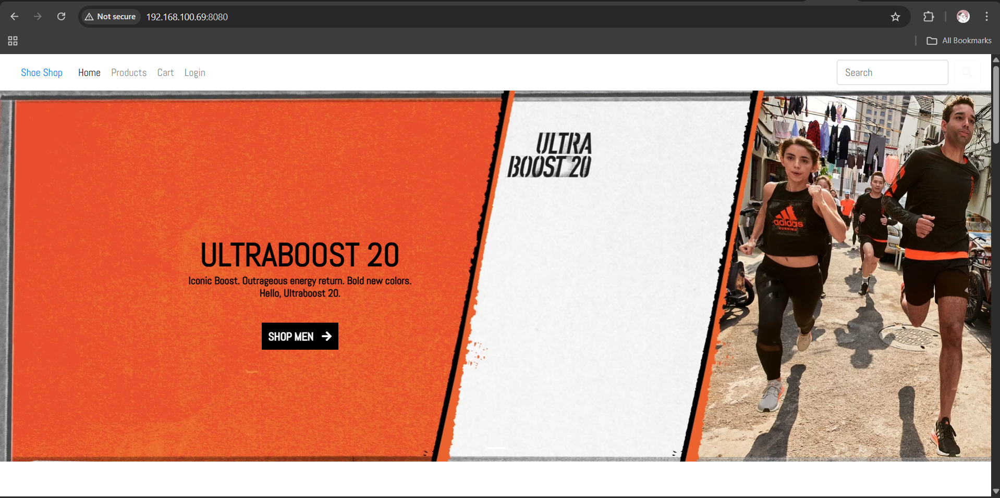

# Cách triển khai dự án trong Linux
## Chuẩn bị

- Một máy ảo Ubuntu để chạy dự án.
- Network Adapter để chế độ Bridge.
- Đã cấu hình IP tĩnh cho máy ảo
  - Trong Ubuntu thì cấu hình file mạng tại:
    ```shell
    nqat0919@dev-server:~$ sudo nano /etc/netplan/00-installer-config.yaml
    ```
  - Nội dung file cấu hình như sau:
    ```shell
    network:
      ethernets:
        ens33: ## Tên card mạng
        dhcp4: false ## Tắt DHCP
        addresses: [192.168.1.69/24] # Địa chỉ IPv4
        gateway4: 192.168.1.1 # Địa chỉ gateway theo IPv4
          nameservers:
            addresses: [8.8.8.8,8.8.4.4] ## DNS servers
    version: 2
    ```
  - Cấu hình xong thì apply với lệnh:
    ```shell
    nqat0919@dev-server:~$ sudo netplan apply
    ```
## Front-end VueJS app - Todolist

Tải dự án [tại đây](https://devopsedu.vn/wp-content/uploads/2024/02/todolist.zip)

Sau khi tải dự án về máy, ta bật windows shell lên và copy file zip chứa dự án sang thư mục của máy ảo bằng lệnh scp

```shell
PS C:\Users\Nguyen Tuan> scp todolist.zip nqat0919@192.168.1.69:/home/nqat0919
```

Sau khi có được file todolist.zip tại thư mục home của user, thì chúng ta cần giải nén, mặc định thì Ubuntu không hỗ trợ tool giải nén, do đó cần phải cài thêm qua lệnh:

```shell
nqat0919@dev-server:~$ sudo apt update && sudo apt install unzip # cài đặt unzip
nqat0919@dev-server:~$ unzip todolist.zip # giải nén file todolist.zip
```

Theo best practice thì, mỗi dự án cần phải nằm trong một thư mục riêng và có một user riêng

Do đó, ta sẽ tạo user mới cho dự án Todolist cũng như package để chứa dự án

```shell
nqat0919@dev-server:~$ sudo adduser todolist
nqat0919@dev-server:~$ sudo mkdir /projects
nqat0919@dev-server:~$ sudo mv todolist /projects/todolist
nqat0919@dev-server:~$ sudo chown -R todolist:todolist /projects/todolist
nqat0919@dev-server:~$ sudo chmod -R 750 /projects/todolist/
nqat0919@dev-server:/projects/todolist$ cd  /projects/todolist
```

Để chạy được dự án front-end thì cần cài đặt nodejs và nginx

```shell
nqat0919@dev-server:/projects/todolist$ sudo apt install -y nodejs npm nginx
todolist@dev-server:/projects/todolist$ npm install
todolist@dev-server:/projects/todolist$ npm run build
todolist@dev-server:/projects/todolist$ ls
babel.config.js  jsconfig.json  package.json       public     src
dist             node_modules   package-lock.json  README.md  vue.config.js
```

Tiếp theo ta sẽ cấu hình để chạy dự án trên Nginx

Đầu tiên, cần phải disable port chạy mặc định của Nginx vì ta thường sẽ muốn chạy port 80, vào sửa file sau (nhớ dùng quyền sudo hoặc root):

```shell
nqat0919@dev-server:/projects/todolist$ sudo nano /etc/nginx/sites-available/default
```

Sửa nội dung đoạn này thành port nào đó không phải 80:

```shell
server {
        listen 8081 default_server;
        listen [::]:8081 default_server;
  ...
}
```

Tiếp theo, chúng ta viết cấu hình để nginx có thể phục vụ tài nguyên dự án Vue vừa được build ra bằng cách tạo một file .conf trong thư mục conf.d/ của nginx.

```shell
nqat0919@dev-server:/projects/todolist$ sudo nano /etc/nginx/conf.d/todolist.conf
```

Nội dung file:

```shell
server {
  listen 80;
  root /projects/todolist/dist/;
  index index.html;
  try_files $uri $uri/ /index.html;
}
```

Sau đó, để cho nginx phục vụ được tài nguyên cho request, nginx cần phải có quyền đọc thư mục dist/

Chúng ta config quyền 750 cho toàn bộ dự án todolist, nghĩa là nginx user cần phải có ít nhất là chung group với user todolist để có thể đọc được file:

```shell
nqat0919@dev-server:/projects/todolist$ sudo usermod -aG todolist www-data
```

Cuối cùng, chúng ta sẽ kiểm tra syntax xem có lỗi sai không và chạy lại dịch vụ nginx:

```shell
nqat0919@dev-server:/projects/todolist$ sudo nginx -t
nginx: the configuration file /etc/nginx/nginx.conf syntax is ok
nginx: configuration file /etc/nginx/nginx.conf test is successful
nqat0919@dev-server:/projects/todolist$ sudo systemctl restart nginx
```

## Back-end Springboot app - Shoeshop

Tải dự án [tại đây](https://devopsedu.vn/wp-content/uploads/2024/02/shoeshop-ecommerce.zip)

### Chuẩn bị

1. Copy dự án sang server linux:

  ```shell
  PS C:\Users\Nguyen Tuan\Desktop> scp shoeshop-ecommerce.zip nqat0919@192.168.100.69:~/
  The authenticity of host '192.168.100.69 (192.168.100.69)' can't be established.
  ED25519 key fingerprint is SHA256:4Jj9fMH5beVvRFxmUXHYpxDnY24ky23oBs6eHmh0g3o.
  This host key is known by the following other names/addresses:
    C:\Users\Nguyen Tuan/.ssh/known_hosts:8: 192.168.101.69
    C:\Users\Nguyen Tuan/.ssh/known_hosts:10: 192.168.1.69
  Are you sure you want to continue connecting (yes/no/[fingerprint])?
  Warning: Permanently added '192.168.100.69' (ED25519) to the list of known hosts.
  nqat0919@192.168.100.69's password:
  shoeshop-ecommerce.zip                                                                100%   25MB  54.7MB/s   00:00
  PS C:\Users\Nguyen Tuan\Desktop> ssh nqat0919@192.168.100.69
  ```

2. Update lại apt và cài đặt unzip để giải nén

  ```shell
  root@dev-server:~# apt update && apt-get update
  root@dev-server:~# apt install unzip
  root@dev-server:~# apt install net-tools
  root@dev-server:~# cd /home/nqat0919
  ```

3. Giải nén file zip, tạo thư mục cho project và user tương ứng

  ```shell
  root@dev-server:/home/nqat0919# unzip shoeshop-ecommerce.zip
  root@dev-server:/home/nqat0919# mkdir /projects && mv ./shoeshop /projects/shoeshop
  root@dev-server:/home/nqat0919# adduser shoeshop
  root@dev-server:/home/nqat0919# chmod -R 750 /projects/shoeshop && chown -R shoeshop:shoeshop /projects/shoeshop
  ```

### Cài đặt phụ thuộc cần thiết

Trước khi muốn deploy một dự án nào đó thì chúng ta cần phải biết dự án là gì và cách deploy của nó như thế nào, trong trường hợp này:
- Đây là một dự án Java Spring Boot có version ít nhất là jdk 1.8 để có thể chạy được.
- Dùng maven để build dự án.
- Có database là mysql.

Vậy chúng ta cần phải cài thêm ít nhất 3 tool để có thể chạy dự án.

1. **Cài đặt jdk 8**

  ```shell
  root@dev-server:/home/nqat0919# apt-get install -y openjdk-8-jdk
  ```

2. **Cài đặt maven, tại đây sẽ cài thủ công thay vì qua apt** (chỉ để giới thiệu là còn cách cài khác trong trường hợp gói không có sẵn trong apt)

   1. Cài đặt gói qua một link nào đó, trong trường hợp này là tải file bin được nén bằng tar.
   2. Giải nén gói tar ra để có được file bin
   3. Chúng ta đặt file bin này vào đâu đó.
   4. Nếu muốn cho người dùng hiện tại sử dụng thư viện này, chúng ta cập nhật lại biến môi trường của họ tại ~/.bash_profile/my-script.sh, đây là nơi chứa các file script sẽ tự động load mỗi khi người dùng đó đăng nhập.
   5. Nhưng trong trường hợp này, chúng ta muốn áp dụng để maven có thể sử dụng trên **Toàn bộ người dùng**, chúng ta sẽ tạo một file script chứa nội dung cập nhật lại biến môi trường và để nó tại /etc/profile.d/my-script.sh
  
  ```shell
  root@dev-server:/home/nqat0919# wget https://dlcdn.apache.org/maven/maven-3/3.9.9/binaries/apache-maven-3.9.9-bin.tar.gz
  root@dev-server:/home/nqat0919# tar -xvf apache-maven-3.9.9-bin.tar.gz -C /opt/
  root@dev-server:/home/nqat0919# ls /opt 
  apache-maven-3.9.9
  root@dev-server:/home/nqat0919# echo 'export M2_HOME="/opt/apache-maven-3.9.9"' > /etc/profile.d/myscript.sh
  root@dev-server:/home/nqat0919# echo 'export PATH="$PATH:$M2_HOME/bin"' >> /etc/profile.d/myscript.sh
  root@dev-server:/home/nqat0919# source /etc/profile.d/myscript.sh
  ```

3. **Cài đặt mysql**

   1. Mysql mặc định chỉ lắng nghe tại 127.0.0.1, nghĩa là nội bộ bên trong máy chủ.
   2. Trong nhiều trường hợp, đây là hanh vi ta mong muốn, nhưng nếu muốn chúng ta có thể cho nó lắng nghe tại mọi nơi (0.0.0.0) để có thể kết nối MySQL từ xa.
   3. Có thể sửa lại cấu hình trong file /etc/mysql/mysql.conf.d/mysqld.cnf


  ```shell
  root@dev-server:/home/nqat0919# apt install -y mysql-server
  root@dev-server:/home/nqat0919# vi /etc/mysql/mysql.conf.d/mysqld.cnf
  root@dev-server:/home/nqat0919# systemctl restart mysql
  root@dev-server:/home/nqat0919# netstat -tlunp
  Active Internet connections (only servers)
  Proto Recv-Q Send-Q Local Address           Foreign Address         State       PID/Program name
  tcp        0      0 0.0.0.0:22              0.0.0.0:*               LISTEN      937/sshd: /usr/sbin
  tcp        0      0 0.0.0.0:33060           0.0.0.0:*               LISTEN      22832/mysqld
  tcp        0      0 0.0.0.0:3306            0.0.0.0:*               LISTEN      22832/mysqld
  tcp        0      0 127.0.0.53:53           0.0.0.0:*               LISTEN      852/systemd-resolve
  tcp6       0      0 :::22                   :::*                    LISTEN      937/sshd: /usr/sbin
  udp        0      0 127.0.0.53:53           0.0.0.0:*                           852/systemd-resolve
  ```

4. **Load dữ liệu cho mysql** 

   1. Chúng ta có thể thực hiện load dữ liệu trong file *.sql vào mysql bằng user root.
   2. Nhưng theo best practice thì quá trình này nên thực hiện bằng một user riêng biệt có quyền với database tương ứng.
   3. Để tạo mới user thì đầu tiên cần đăng nhập với quyền root rồi dùng lệnh
      
      **CREATE USER 'newuser'@'%' IDENTIFIED BY 'password';**
   
      **GRANT ALL PRIVILEGES ON shoestore.\* TO 'newuser'@'%';**
   
      **FLUSH PRIVILEGES;**
   
      1. '%' sẽ là wildcard chỉ định rằng user này có thể được kết nối từ bất kỳ địa chỉ IP nào.
      2. Sau khi thực hiện xong thì cần phải flush để làm mới quyền người dùng.

  ```shell
  root@dev-server:/home/nqat0919# mysql -u root
  
  mysql> CREATE USER 'shoestore'@'%' IDENTIFIED BY 'shoestore';
  Query OK, 0 rows affected (0.01 sec)
  
  mysql> GRANT ALL PRIVILEGES ON shoestore.* TO 'shoestore'@'%';
  Query OK, 0 rows affected (0.00 sec)
  
  mysql> FLUSH PRIVILEGES;
  Query OK, 0 rows affected (0.01 sec)
  
  mysql> create database shoestore;
  Query OK, 1 row affected (0.00 sec)
  
  mysql> exit
  Bye
  ```

Sau khi chuẩn bị xong database, có thể đăng nhập bằng user vừa tạo rồi tiến hành load dữ liệu từ file sql.

  ```shell
  root@dev-server:/home/nqat0919# su shoeshop && cd /projects/shoeshop
  shoeshop@dev-server:/projects/shoeshop$ ls
  pom.xml  README.md  shoe_shopdb.sql  src
  shoeshop@dev-server:/projects/shoeshop$ mysql -u shoestore -p
  
  mysql> source ./shoe_shopdb.sql
  
  mysql>exit
  Bye
  ```

6. **Chỉnh sửa lại file cấu hình để nó kết nối đến mysql**

  ```shell
  shoeshop@dev-server:/projects/shoeshop$ find . -name "*application*"
  ./src/main/resources/application.properties
  shoeshop@dev-server:/projects/shoeshop$ vi ./src/main/resources/application.properties
  ```

### Deploy dự án

Sau khi đã cài đặt xong hết các phụ thuộc cần thiết, chúng ta tiến đến bước deploy dự án Back-end.

Tại thư mục chứa dự án, chạy các lệnh sau:

```shell
shoeshop@dev-server:/projects/shoeshop$ mvn package -DSkipTest=True
shoeshop@dev-server:/projects/shoeshop$ ls
pom.xml  README.md  shoe_shopdb.sql  src  target
```

Sau khi đảm bảo build thành công và có file target, tiến hành chạy dự án:

```shell
shoeshop@dev-server:/projects/shoeshop$ nohup java -jar target/shoe-ShoppingCart-0.0.1-SNAPSHOT.jar > 0.0.1-snapshot.log 2>&1 &
[1] 23940
```

- `nohup`: Chạy lệnh mà không bị dừng khi bạn thoát terminal (không bị ảnh hưởng khi logout).
- `> /path/to/logfile.log`: Chuyển output chuẩn (stdout) vào file log.
- `2>&1`: Chuyển output lỗi (stderr) vào cùng file log. 2 đại diện cho stderr và >&1 có nghĩa là chuyển stderr vào nơi stdout đang đi (ở đây là file log).
- `&`: Chạy lệnh ở chế độ nền (background), cho phép bạn tiếp tục sử dụng terminal mà không phải chờ lệnh đó chạy xong.

Kết quả:
