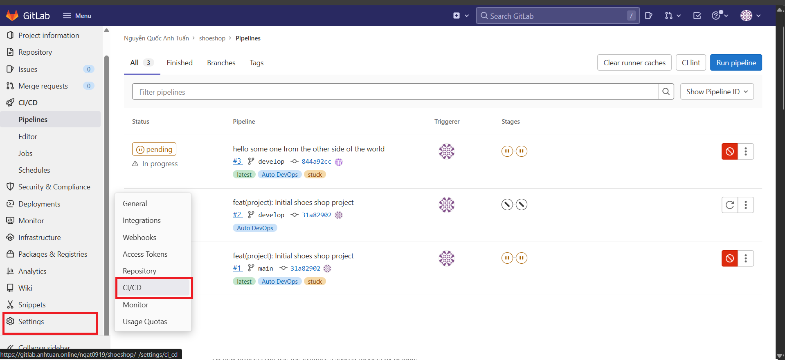
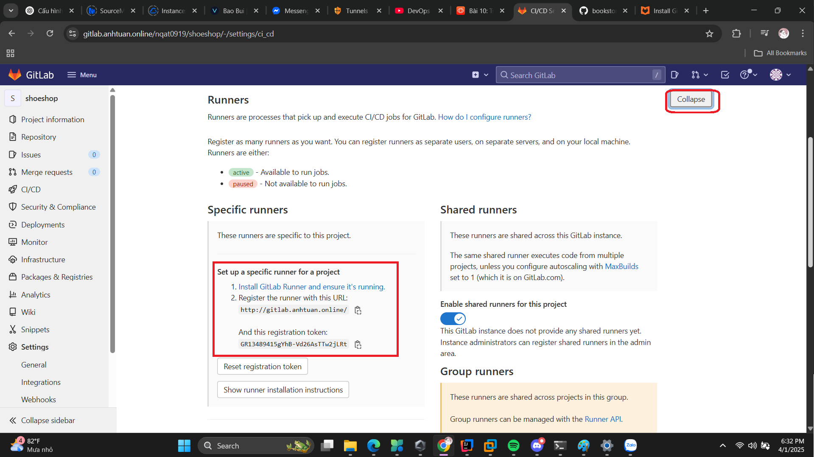
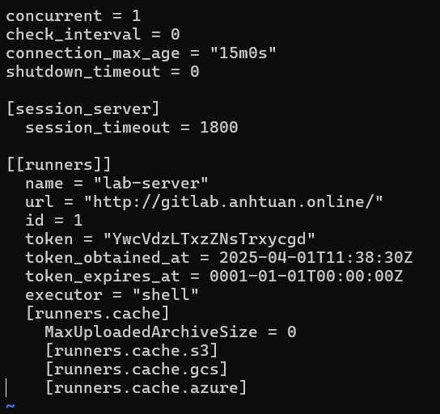
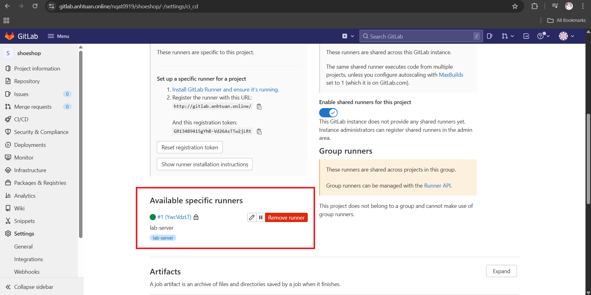
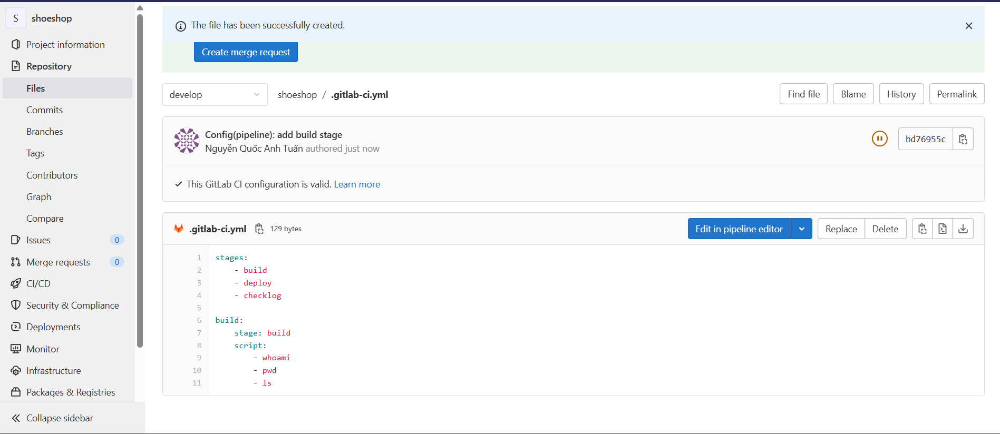
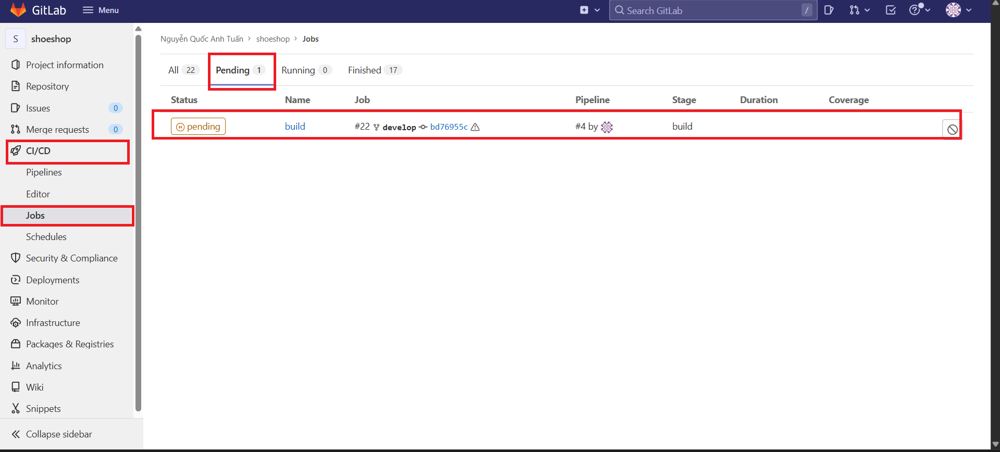
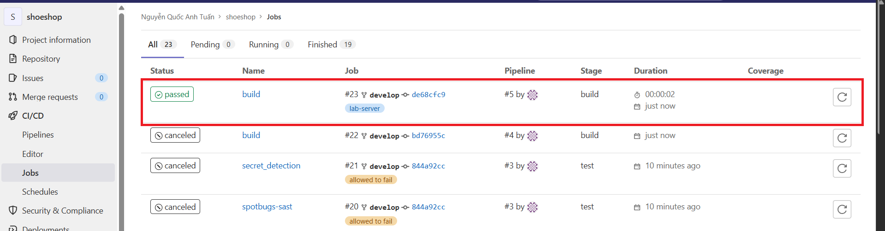
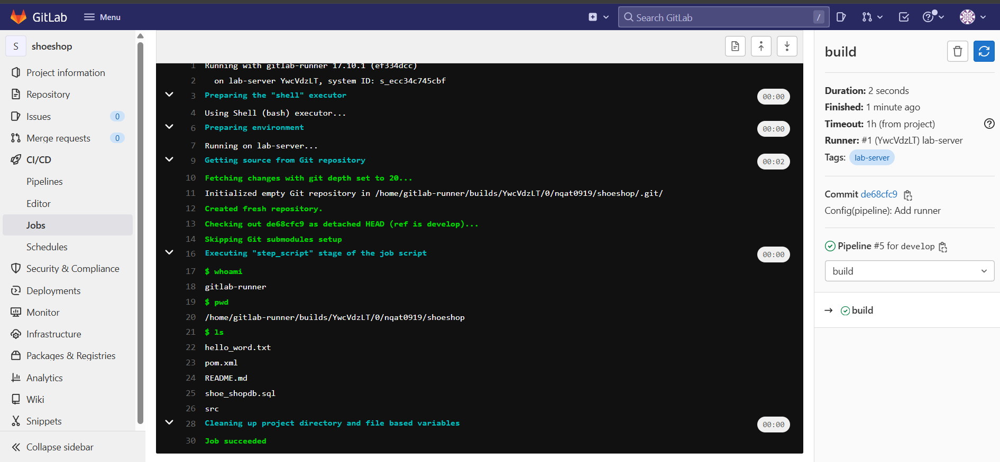
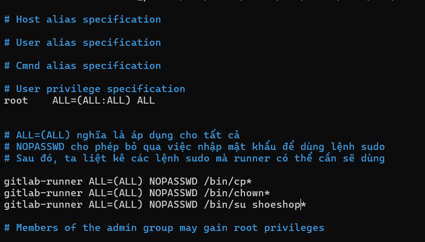
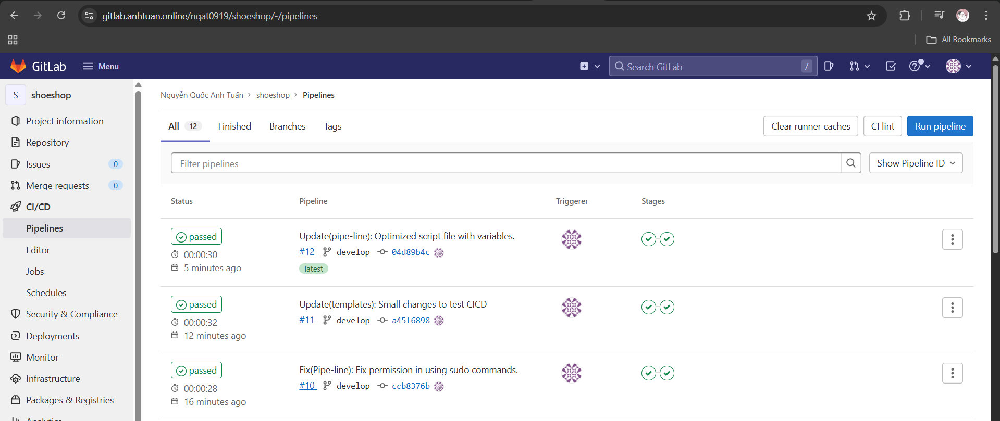

# CI/CD
Trong dự án thực tế, quy trình CI/CD gần như không thể thiếu đối với bất kì doanh nghiệp nào, với CI/CD thì doanh nghiệp sẽ có thể giảm thiểu được chi phí cho nhiều công đoạn cũng như đẩy nhanh tốc độ phát triển dự án.

Cụ thể, CI/CD sẽ giúp các thao tác thủ công lặp đi lặp lại trong một quy trình phát triển dự án trở nên tự động, nhờ đó tiết kiệm được thời gian và giảm thiểu lỗi phát sinh do con người gây ra.

CI/CD bao gồm các quá trình sau:

- **Continuous Integration**: Tích hợp liên tục, bao gồm các bước clone code, build dự án, test dự án, test performance, test clean code, test bảo mật, ... để có thể đảm bảo được chất lượng source code.
- **Continuous Deployment**: Triển khai hoàn toàn tự động, là một chiến lược triển khai trong chữ **CD**, dev chỉ cần thêm một dòng commit code là code sẽ tự động được triển khai mà không cần thêm một bước nào nữa.
- **Continuous Delivery**: Triển khai thủ công, chúng ta sẽ có một bước xác nhận để có thể triển khai dự án.

Có hai công cụ triển khai CI/CD rất nổi tiếng và được sử dụng rộng rãi là **Gitlab CI/CD** và **Jenkins**.

## Gitlab CI/CD

Về cơ bản, các thành CI/CD của Gitlab khá nhiều, nhưng chúng ta có thể tóm gọn lại như sau:

Các công việc triển khai dài dòng mà ta đã triển khai tại dự án [front end](../devops/devops-1.md#front-end-vuejs-app---todolist) và [back-end](../devops/devops-1.md#back-end-springboot-app---shoeshop) trước đó, giờ có thể hoàn toàn tự động nhờ cài một chương trình nào đó đóng vai trò như **Một con robot**, còn nhiệm vụ của chúng ta là **Viết kịch bản** cho nó hoạt động.

Vậy quy trình CI/CD sẽ tóm gọn lại gồm các bước sau: 

1. Cài đặt một công cụ tự động làm việc.
2. Viết file cấu hình công việc cho công cụ đó.

Con robot trong trường hợp này là **Gitlab Runner**, chúng ta cần cài công cụ này trên server mà chúng ta cần triển khai dự án.

Kịch bản thì sẽ được viết trong một file có format tên là **.gitlab-ci.yaml**

### Cài công cụ Gitlab Runner

Bài viết hướng dẫn [tại đây](https://docs.gitlab.com/runner/install/linux-repository/)

Chúng ta sẽ tiến hành cài công cụ này tại [**lab-server**](../devops/devops-2.md#cách-thiết-lập-một-server-gitlab)

```shell
root@lab-server:/data/shoeshop# curl -L "https://packages.gitlab.com/install/repositories/runner/gitlab-runner/script.deb.sh" | sudo bash
root@lab-server:/data/shoeshop# sudo apt install gitlab-runner
root@lab-server:/data/shoeshop# gitlab-runner -v
Version:      17.10.1
Git revision: ef334dcc
Git branch:   17-10-stable
GO version:   go1.23.6 X:cacheprog
Built:        2025-03-26T12:24:33Z
OS/Arch:      linux/amd64
```

Tương tự như các công cụ như **nginx**, gitlab-runner cũng sẽ có một user riêng cho nó là **gitlab-runner**

### Kết nối Gitlab Runner với dự án Gitlab

Trên giao diện Gitlab, vào **Settings > CI/CD**



Tại trang CI/CD, Expand section **Runner**, tại đây có một số thông tin dùng để đăng ký **Gitlab Runner** với server.



Quay lại màn hình CLI của **lab-server**, gõ lệnh:

```shell
root@lab-server:/data/shoeshop# gitlab-runner register
```
- Trường đầu tiên: nhập gitlab url.
- Trường thứ hai: nhập registration token.
- Trường thứ ba: nhập mô tả để giúp xác định được chính xác runner này thuộc về server nào.
- Trường thứ tư: nhập tag, hay nói cách khác là tên của con runner này.

```shell
Enter the GitLab instance URL (for example, https://gitlab.com/):
http://gitlab.anhtuan.online/
Enter the registration token:
GR13489415gYhB-Vd26AsTTw2jLRt
Enter a description for the runner:
[lab-server]: lab-server
Enter tags for the runner (comma-separated):
lab-server
Enter optional maintenance note for the runner:

WARNING: Support for registration tokens and runner parameters in the 'register' command has been deprecated in GitLab Runner 15.6 and will be replaced with support for authentication tokens. For more information, see https://docs.gitlab.com/ee/ci/runners/new_creation_workflow
Registering runner... succeeded                     runner=GR13489415gYhB-Vd
Enter an executor: custom, shell, ssh, docker, instance, parallels, virtualbox, docker-windows, docker+machine, kubernetes, docker-autoscaler:
```

Tiếp theo, hệ thống yêu cầu chúng ta chọn executor, đối với người mới thì chúng ta chỉ nên quan tâm **shell** và **docker**. Giải thích sơ lược thì:

- **shell**: Những câu lệnh mà chúng ta dùng trong kịch bản sẽ chạy trực tiếp trên server.
- **docker**: Tạo ra một môi trường độc lập và chạy những kịch bản đó.

Trong trường hợp này, ta chọn **shell**.

```shell
Enter an executor: custom, shell, ssh, docker, instance, parallels, virtualbox, docker-windows, docker+machine, kubernetes, docker-autoscaler:
shell
Runner registered successfully. Feel free to start it, but if it's running already the config should be automatically reloaded!

Configuration (with the authentication token) was saved in "/etc/gitlab-runner/config.toml"
```

Tiếp theo chúng ta có thể vào file **/etc/gitlab-runner/config.toml** để xem cấu hình:



Tiếp theo, chúng ta chạy lệnh:

```shell
root@lab-server:/data/shoeshop# nohup gitlab-runner run \
  --working-directory /home/gitlab-runner \
  --config /etc/gitlab-runner/config.toml \
  --user gitlab-runner 2>&1 &
```
- `nohup`:
  - Giúp tiến trình không bị dừng khi thoát terminal.
  - Nếu không dùng nohup, khi bạn đóng terminal, tiến trình có thể bị dừng.
  - Mặc định, output sẽ ghi vào file nohup.out trừ khi được chuyển hướng.
- `--working-directory /home/gitlab-runner`:
  - Xác định thư mục làm việc của runner là /home/gitlab-runner (nơi chứa dữ liệu job, cache, logs, v.v.).
- `--config /etc/gitlab-runner/config.toml`:
  - Sử dụng file cấu hình /etc/gitlab-runner/config.toml để lấy thông tin runner.
- `--user gitlab-runner`:
  - Chạy tiến trình với user gitlab-runner, thay vì root, giúp tăng bảo mật.
- `2>&1`:
  - Chuyển hướng stderr (lỗi) sang stdout (output chuẩn).
  - Tức là lỗi và output đều ghi ra cùng một nơi (thường là nohup.out).
- `&`:
  - Chạy tiến trình ở chế độ nền (background).

Có thể kiểm tra xem có chạy thành công hay không bằng lệnh:

```shell
root@lab-server:/data/shoeshop# ps -ef | grep --color=auto gitlab-runner
```
- `-e`: Hiển thị tất cả các tiến trình (bao gồm cả tiến trình của các user khác).
- `-f`: Hiển thị đầy đủ thông tin về tiến trình (full format).

Ngoài ra, F5 lại trang gitlab để xem runner đã kết nối thành công hay chưa



### Viết kịch bản cho Runner

Chúng ta có thể viết một file **.gitlab-ci.yml** chứa kịch bản đơn giản cho stage build như sau:

```yaml
stages:
    - build
    - deploy
    - checklog

build:
    stage: build
    script:
        - whoami
        - pwd
        - ls
```

Kịch bản này chỉ đơn giản là tại stage build sẽ check xem user hiện tại là ai, đang ở đâu và có file gì tại chỗ đang đứng.

Chúng ta commit file này lên trên Gitlab tại cấp ngoài cùng, ngang với thư mục src của dự án.



Tiếp theo, chúng ta qua **CI/CD** > **Jobs** thì thấy có một jobs đang kẹt, điều này là do chúng ta chưa chỉ định rõ xem agent nào sẽ chạy job này tại file kịch bản.



Có thể cancel job này đi và sửa lại file kịch bản như sau:

```yaml
stages:
  - build
  - deploy
  - checklog

build:
  stage: build
  script:
    - whoami
    - pwd
    - ls
  tags:
    - lab-server
```

Sau khi commit file mới thì vào Jobs kiểm tra lại thì thấy một job đã pass



Kiểm tra cụ thể, thấy được runner đã chạy các lệnh mà ta yêu cầu:



Tiếp theo, chúng ta sẽ tiến hành viết một pipeline với đầy đủ các stage, nhưng trước khi viết chúng ta cần phải nghĩ một số quan ngại có thể gặp để đảm bảo viết được một kịch bản chạy không gặp vấn đề.

1. Dự án nằm trong thư mục home của runner trong khi chúng ta muốn nó nằm ở một số thư mục riêng biệt hơn.
2. Trong quá trình chạy, runner sẽ tự động clone dự án trên gitlab về và chạy, nhưng chúng ta lại muốn đảm bảo quy tắc mỗi dự án do một user riêng biệt của dự án đó chạy.
3. Runner đôi khi sẽ cần một số quyền hạn cao hơn để có thể thực hiện các lệnh đặc biệt.
4. Khi deploy dự án mới, phải đảm bảo là không có phiên bản nào của dự án đang chạy trước đó để tránh tình trạng chiếm giữ port của nhau.

Từ những quan ngại trên, chúng ta sẽ tiến hành dựng kịch bản phù hợp.

Vấn đề **1.** có thể xử lý bằng cách tạo riêng một thư mục **/datas** và copy file target sau khi đã build xong vào thư mục này.

Vấn đề **2.** và **3.** có thể vượt qua bằng cách cho phép runner có thể thực hiện lệnh `sudo` để vượt quyền.

Thế nhưng, việc thêm runner vào nhóm **sudoers** sẽ không phải là cách giải quyết triệt để vì khi dùng quyền sudo, vẫn cần phải nhập mật khẩu, đây là điều bất khả thi trong môi trường kịch bản tự động.

Thế nên, ta cần phải cho phép runner sử dụng **sudo không cần mật khẩu** đối với **một số lệnh cụ thể**.

Dùng lệnh **visudo** để mở giao diện chỉnh sửa sudo (dùng quyền root).



Về ý tưởng **4.**, ý tưởng sẽ là sau khi chúng ta build xong dự án, sẽ viết ngay PID của tiến trình vào một file nào đó để đọc lại lần sau, ở lần chạy sau trước khi build thì chúng ta sẽ kiểm tra file có tồn tại hay không, rồi kill PID đọc được trong file trước khi deploy.

Đoạn kịch bản hoàn chỉnh như sau:

```yaml
variables:
  projectName: shoe-ShoppingCart
  version: 0.0.1-SNAPSHOT
  projectUser: shoeshop
  projectPath: /datas/shoeshop
stages:
    - build
    - deploy
    - checklog

build:
    stage: build
    variables:
        GIT_STRATEGY: clone # Bước này định nghĩa rõ ràng ra là sẽ clone một git project mới về
    script:
        - mvn install -DSkipTest=true
    tags:
        - lab-server
deploy:
    stage: deploy
    variables:
        GIT_STRATEGY: none # Bước này định nghĩa rõ ràng ra là đừng clone git project mới về vì sẽ khiến cho code tại stage build bị mất hết
    script:
        - sudo cp target/$projectName-$version.jar $projectPath
        - sudo chown -R $projectUser:$projectUser $projectPath
        # dừng tiến trình trước đó nếu có
        - |
          if [ -f $projectPath/app.pid ]; then
            PID=$(cat $projectPath/app.pid)
            if ps -p $PID > /dev/null 2>&1; then # Chuyển hướng output của $PID vào /dev/null, ẩn kết quả để khỏi hiện ra màn hình
              echo "Stopping previous process with PID $PID"
              sudo su $projectUser -c "kill -9 $PID"
            else
              echo "Process $PID is not running"
            fi
            sudo su $projectUser -c "rm -f $projectPath/app.pid"
          else
            echo "No existing PID file found, skipping process termination"
          fi
        # flag -c chỉ định luôn câu lệnh sẽ chạy ngay sau khi switch user
        # chạy tiến trình dưới nền, chuyển hướng output và lỗi vào chung một file riêng
        # dùng nohup để đảm bảo tiến trình vẫn chạy kể cả khi đã thoát terminal
        # ghi pid của process gần nhất (chính bản thân chương trình) để dễ dàng kill cho lần chạy sau.
        - sudo su $projectUser -c "cd $projectPath/; nohup java -jar shoe-ShoppingCart-0.0.1-SNAPSHOT.jar > $projectPath/app.log 2>&1 & echo \$! > $projectPath/app.pid"
    tags:
        - lab-server
```

Sau khi commit, gitlab runner sẽ tự động build và deploy phiên bản mới nhất của dự án.



### Gitlab CI/CD bằng Docker

Bên cạnh việc viết kịch bản deploy dự án trực tiếp trên máy, chúng ta có thể đóng gói dự án thành các container và sẽ viết kịch bản để dùng docker deploy.

```yaml
variables:
  DOCKER_IMAGE: ${REGISTRY_URL}/${CI_PROJECT_NAME}/${CI_COMMIT_TAG}:${CI_COMMIT_SHORT_SHA}
  DOCKER_CONTAINER: shoeshop
stages:
    - build
    - deploy
    - showlog

build:
    stage: build
    variables:
        GIT_STRATEGY: clone
    before_script:
        - docker login ${REGISTRY_URL} -u ${REGISTRY_USER} -p ${REGISTRY_PASSWD}
    script:
        - docker build -t $DOCKER_IMAGE .
        - docker push $DOCKER_IMAGE
    tags:
        - lab-server
    only:
        - tags
deploy:
    stage: deploy
    variables:
        GIT_STRATEGY: none
    script:
        - docker pull $DOCKER_IMAGE
        - docker rm -f $DOCKER_CONTAINER
        - docker run --name $DOCKER_CONTAINER -d -p 18181:8080 $DOCKER_IMAGE
    tags:
        - lab-server
    only:
        - tags
showlog:
    stage: showlog
    variables:
        GIT_STRATEGY: none
    script:
        - sleep 10
        - docker logs $DOCKER_CONTAINER
    tags:
        - lab-server
    only:
        - tags
```