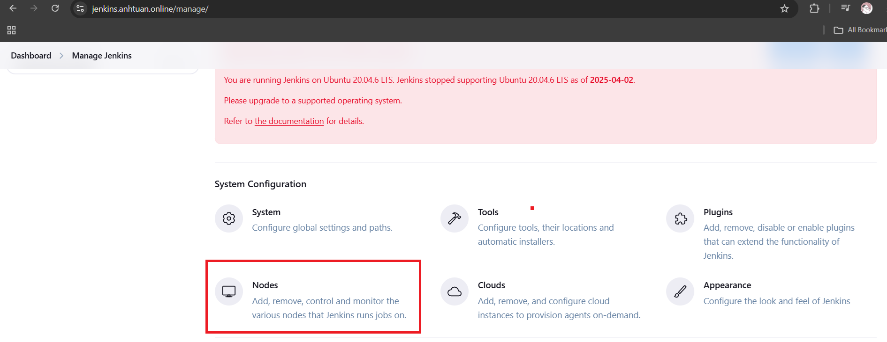
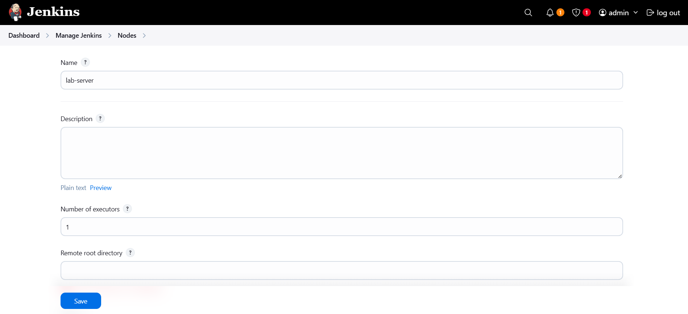
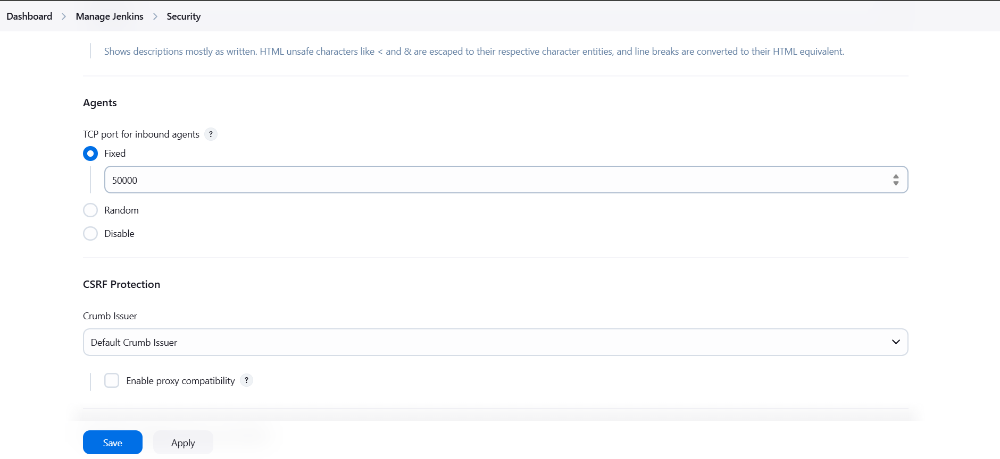
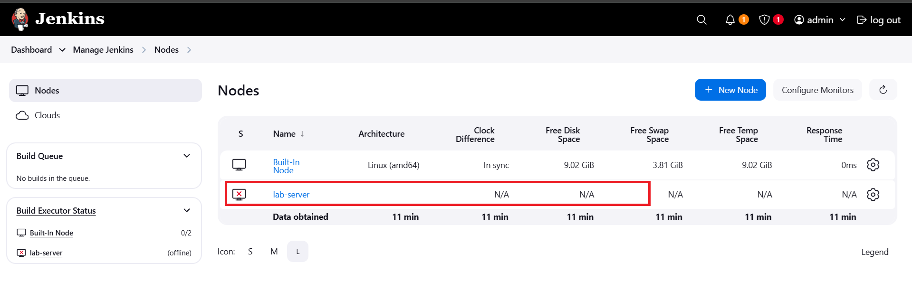
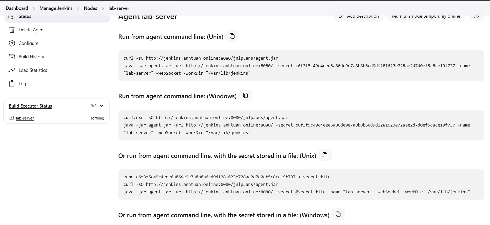

## Jenkins CI/CD

Bên cạnh **[Gitlab CI/CD](./devops-3.md#gitlab-cicd)** thì trên thực tế các doanh nghiệp cũng rất hay dùng Jenkins Server để quản lý CI/CD. Thế nên việc tìm hiểu Jenkins bên cạnh Gitlab CI/CD cũng rất quan trọng trong lĩnh vực DevOps.

### Chuẩn bị

- Một máy ảo gitlab hoặc 1 github repo có sẵn project để thực hành.
- Một máy ảo / VPS để cài Jenkins Server.

### Cài đặt jenkins server

Nhập đoạn script sau để cài đặt Jenkins:

```shell
#!/bin/bash

apt install openjdk-17-jdk openjdk-17-jre -y
java --version
wget -p -O - https://pkg.jenkins.io/debian/jenkins.io.key | apt-key add -
sh -c 'echo deb http://pkg.jenkins.io/debian-stable binary/ > /etc/apt/sources.list.d/jenkins.list'
apt-key adv --keyserver keyserver.ubuntu.com --recv-keys 5BA31D57EF5975CA
apt-get update
apt install jenkins -y
systemctl start jenkins
```

Mặc định thì Jenkins sẽ serve tại port 8080, nhưng vì chúng ta cài riêng một server dành cho Jenkins, cho nên chúng ta sẽ dùng **Reverse Proxy** để điều hướng truy cập đến port 8080 bằng Nginx.

```shell
apt install nginx
vi /etc/nginx/conf.d/jenkins.anhtuan.online.conf
```

```shell
server {
    listen 80;
    server_name jenkins.anhtuan.online;

    location / {
        proxy_pass http://localhost:8080;  # Chuyển hướng request tới Jenkins
        proxy_set_header Host $host;
        proxy_set_header X-Real-IP $remote_addr;
        proxy_set_header X-Forwarded-For $proxy_add_x_forwarded_for;
        proxy_set_header X-Forwarded-Proto $scheme;

        # Tăng timeout để tránh lỗi timeout khi build
        proxy_connect_timeout 300;
        proxy_send_timeout 300;
        proxy_read_timeout 300;

        # WebSocket support (nếu Jenkins cần)
        proxy_http_version 1.1;
        proxy_set_header Upgrade $http_upgrade;
        proxy_set_header Connection "Upgrade";
    }

    # Giảm rủi ro bảo mật
    add_header X-Frame-Options SAMEORIGIN;
    add_header X-XSS-Protection "1; mode=block";
    add_header X-Content-Type-Options nosniff;
}
```

Sau khi đăng nhập vào giao diện Jenkins, tiến hành cài các plugins mặc định


Sau khi cài đặt xong Jenkins, thì thư mục home của nó là **/var/lib/jenkins**, đồng thời jenkins cũng tạo một user tương ứng cho nó là **jenkins**.

Có nhiều tùy chọn để thao tác tại trang dashboard, nhưng hiện tại quan trọng nhất sẽ là phần **Nodes**, đây là nơi chúng ta quản lý và thêm jenkins agent vào server.

- Theo cách thông thường thì Jenkins sẽ ssh tới máy host và tiến hành deploy tại đó, nhưng SSH là kết nối ngang hàng cho nên đây có thể xem là một cách tiếp cận rủi ro.
- Một cách tiếp cận khác khuyến khích sử dụng hơn là chúng ta sẽ đăng ký các Jenkins agent, các Jenkins agent này sẽ đc cài đặt ở máy host và sẽ tự dộng đăng ký chính nó với Jenkins Server.
- Jenkins agent sẽ "nhận lệnh" từ server và tiến hành triển khai dự án.



Cách tiếp cận của chúng ta sẽ là: **Jenkins Server** là nơi quản lý Pipeline, không phải là nơi triển khai dự án.

### Cài đặt Jenkins agent

Trước khi cài đặt Jenkins agent thì chúng ta cần phải đảm bảo nó có cùng phiên bản với Jenkins server.

Tiếp theo, tạo một user jenkins trên server sẽ cài jenkins agent (server host)

Tiếp theo, tạo một node trên màn hình dashboard của jenkins server



Nhập **Remote root directory** là **/var/lib/jenkins**, phải đảm bảo thư mục này cũng đã tồn tại trên server host, nếu chưa có thì tạo với lệnh mkdir.

Vì agent cần phải đi vào jenkins server, cho nên tại jenkins server chúng ta cần phải setup một inbound rule tại một port nào đó để cho phép jenkins agent có thể đi vào.



Các trường còn lại có thể để mặc định.

Sau khi thiết lập xong node, bấm vào để chuyển sang trang hướng dẫn cài đặt jenkins agent tương ứng tại host server.



Tại đây jenkins sẽ generate sẵn cho chúng ta các câu lệnh để paste vào mà không cần phải tự tay nhập.



Lưu ý, trước khi paste câu lệnh vào server host thì chúng ta nên chuyển sang user jenkins, vì câu lệnh này sẽ cài đặt một số công cụ nhất định, nên best practice là quyền truy cập các công cụ này nên thuộc về bản thân user jenkins.

Sau khi agent kết nối thành công, chúng ta sẽ tiến hành tạo pipeline