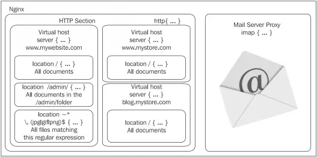

# I. Web Server là gì?
Máy chủ Web (Web Server) là một máy chủ sẽ được cài đặt các phần mềm thích hợp để phục vụ web, đôi khi người ta cũng gọi chính bản thân phần mềm đó là Web Server.

Tất cả các Web Server đều sẽ hiểu và phục vụ được các file *.htm và *.html. Tuy nhiên mỗi web server lại phục vụ một số kiểu file chuyên biệt chẳng hạn như llS của Microsoft dành cho *.asp, *.aspx…; Apache, Nginx dành cho *.php…; Sun Java system web server của SUN dành cho *.jsp…

Về bản chất, Web Server là một dịch vụ phục vụ nội dung tĩnh cho trình duyệt bằng cách tải tập tin từ đĩa và chuyển nó lên mạng, tới người sử dụng thông qua trình duyệt web. Sự trao đổi hoàn toàn này được thực hiện gián tiếp thông qua một trình duyệt và một máy chủ kết nối tới một thiết bị khác sử dụng HTTP. Bất kỳ máy tính nào cũng có thể vào trong một dịch vụ web bằng cách cài đặt phần mềm dịch vụ và kết nối internet.

# II. Tìm hiểu Nginx

Nginx là một máy chủ reverse proxy mã nguồn mở cho các giao thức HTTP, HTTPS, SMTP, POP3 và IMAP, cũng có thể đóng vai trò như một máy chủ cân bằng tải hoặc cache. Nginx tập trung vào tính đồng thời cao, hiệu năng cao và sử dụng tài nguyên thấp.

Không giống với các Web Server truyền thống, Nginx không sử dụng thread để xử lý yêu cầu. Thay vào đó nó sử dụng một kiến trúc bất đồng bộ hướng sự kiện. Kiến trúc này sử dụng ít bộ nhớ và có thể dự đoán đc trước lượng bộ nhớ sẽ sử dụng khi hoạt động. Nginx chính là một trong số các máy chủ có thể giải quyết được bài toán C10K.

C10K là bài toán nói về việc do các máy chủ web truyền thống sử dụng thread để xử lý yêu cầu, cho nên nếu số lượng yêu cầu đồng thời quá cao sẽ dẫn đến lượng thread sinh ra cũng sẽ quá nhiều và đến một lúc nào đấy sẽ xảy ra tình trạng thiếu hụt tài nguyên trên máy chủ khi cố cung cấp cho các luồng xử lý trên

## Kiến trúc của Nginx

### 1) Module HTTP trong Nginx

Module HTTP Core là thành phần sẽ chứa tất cả các khối, chỉ thị và biến cơ bản của máy chủ HTTP. Mặc định thì module này được cài đặt trong lúc biên dịch, nhưng không được bật lên khi Nginx đang chạy, việc sử dụng module này là không bất buộc.

Module này là một trong các module tiêu chuẩn lớn nhất của Nginx - cung cấp một số lượng lớn các chỉ thị (directive) và biến. Có ba khối chỉ thị chính mà chúng ta sẽ cần quan tâm là: `http`, `server` và `location`.

- `http`: Được khai báo ở phần đầu của tập tin cấu hình. Cho phép chúng ta định nghĩa các chỉ thị và các khối từ tất cả các module liên quan đến khía cạnh HTTP của Nginx. Khối này có thể được khai báo nhiều lần trong file cấu hình nhưng nội dung khối sau sẽ ghi đè lên khối trước.
- `server`: Khối này cho phép chúng ta khai báo một website. Nói cách khác, 1 website cụ thể (được nhận diện bởi 1 hoặc nhiều hostname) được thừa nhận bới Nginx và nhận cấu hình của chính nó. Khối này chỉ có thể được dùng bên trong khối http.
- `location`: Định nghĩa một nhóm các thiết lập sẽ được áp dụng đối với một vị trí cụ thể nào đó của website, khối này sẽ được dùng bên trong khối website hoặc nằm lồng bên trong một khối location khác.



Trong biểu đồ trên, khu vực HTTP, được định nghĩa bởi khối http, bao quanh toàn bộ các cấu hình liên quan đến web. Nó cũng chứa 1 hoặc nhiều khối server, định nghĩa các tên miền của các website mà chúng ta có. Với mỗi website này, chúng ta có thể định nghĩa nhiều khối location mà cho phép chúng ta áp dụng các thiết lập bổ sung đến 1 URI yêu cầu cụ thể của website hoặc các URI yêu cầu khớp 1 mẫu nào đó.

### 2) Các chỉ thị thường gặp

#### 2.1) Chỉ thị liên quan đến HOST và SOCKET

- `listen`: 
  - Sử dụng trong khối `server`.
  - Chỉ rõ địa chỉ IP và/hoặc port được dùng bởi socket phục vụ website. Các website thường sẽ được phục vụ trên port 80 hoặc 443.
  - Cú pháp: `listen [address] [:port] [additional options];`
  - Tùy chọn bổ sung:
    - `default`, `default_server`: Chỉ rõ khối server này được dùng như website mặc định cho bất kỳ yêu cầu nhận được tại địa chỉ IP và port được chỉ rõ.
    - `ssl`: Chỉ rõ website sẽ sử dụng SSL.
    - Các tùy chọn khác liên quan đến các lời gọi hệ thống bind và listen gồm: `backlog=num`, `rcvbuf=size`, `sndbuf=size`, `accept_filter=filter`, `deferred`, `setfib=number` và `bind`.
  - Ví dụ:
    - ```sh
        listen 192.168.1.1:80;
        listen 127.0.0.1;
        listen 80 default;
        listen 443 ssl;
        ```
    
- `server_name`:
  - Sử dụng trong khối `server`.
  - Đăng ký 1 hoặc nhiều hostname cho khối server. Khi nginx nhận 1 yêu cầu HTTP, nó so sánh giá trị Host bên trong phần header của yêu cầu với tất cả các khối server hiện có. Khối server đầu tiên khớp với hostname này sẽ được chọn.
    - Nếu không có khối `server` nào khớp hostname. Nginx chọn khối đầu tiên khớp với các thông số hiển thị của listen.
  - Cú pháp: `server_name hostname1 [hostname2...];` 
  - Ví dụ:
    - ```sh
      server_name www.acb.com;
      server_name www.abc.com abc.com;
      server_name *.website.com; # nhận tất cả các domain có đuôi là .website.com
      server_name .website.com; # Kết hợp cả *.website.com và website.com
      server_name *.website.*;
      server_name ~^\.example\.com$;
      ```
- `server_name_in_redirect`:
  - Sử dụng trong khối `server`, `http`, `location`
  - Chỉ thị này quy định rằng Nginx có nên dùng `server_name` khi tạo URL chuyển hướng (redirect) hay không.
    - Giá trị mặc định là `off`.
    - Khi bạn dùng một số lệnh như `return 301,` `error_page`, hoặc redirect trong `try_files`, Nginx có thể tạo URL tuyệt đối (VD: https://example.com/some/path).
    - Khi đó, nếu `server_name_in_redirect` được bật (`on`), Nginx sẽ lấy giá trị của `server_name` làm phần host trong URL.
    - Nếu tắt (`off`), Nginx sẽ dùng giá trị từ request gốc (thường là `Host` header do client gửi đến).
  - Ví dụ:
    - ```shell
      server {
          listen 80;
          server_name example.com;
          server_name_in_redirect on;
    
          location / {
              return 301 https://$server_name$request_uri;
          }
      }
      ```
    - Nếu client truy cập `https://123.456.789`, Nginx sẽ redirect họ đến `https://example.com/`;
    - Nhưng nếu giá trị là `off`, Nginx sẽ redirect họ đến: `https://123.456.789`.
- `port_in_redirect`:
  - Sử dụng `server`, `http`, `location`.
  - Chỉ thị này quy định rằng có nên bao gồm cổng (port) trong URL khi Nginx thực hiện redirect hay không.
    - Chỉ thị này khá tương tự như `server_name_in_redirect`.
    - Ví dụ:
      - ```shell
          server {
          listen 8080;
          server_name example.com;
          port_in_redirect on;
              location / {
                  return 301 https://$server_name$request_uri;
              }
          }
        ```
      - Khi truy cập `http://example.com:8080/`, Nginx sẽ redirect tới: `https://example.com:8080/`.
      - Còn nếu để `off`, Nginx sẽ redirect tới: `https://example.com/`

#### 2.2) Chỉ thị liên quan đến cấu hình đường dẫn và tài liệu
- `root`:
  - Sử dụng trong khối: `server`, `http`, `location`, `if`.
  - Dùng để xác định thư mục gốc trong hệ thống file mà Nginx sẽ tìm nội dung tĩnh để phục vụ khi có request đến.
  - Cú pháp: `root <đường dẫn>;`.
  - Ví dụ:
    - ```shell
      server {
      listen 80;
      server_name example.com;
          root /var/www/html;
          location / {
              index index.html;
          }
      }
      ```
    - Khi truy cập `http://example.com/index.html`, Nginx sẽ tìm file ở: `/var/www/html/index.html`.
  - Lưu ý khi sử dụng, `root` **_hoạt động với location hiện tại_**:
    - ```shell
      location /images/ {
          root /var/www/assets;
      }
      ```
    - Giả sử user truy cập: `http://example.com/images/logo.png`. Nginx sẽ tìm file tại: `/var/www/assets/images/logo.png`.
    - Không phải `/var/www/assets/logo.png`!