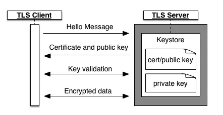
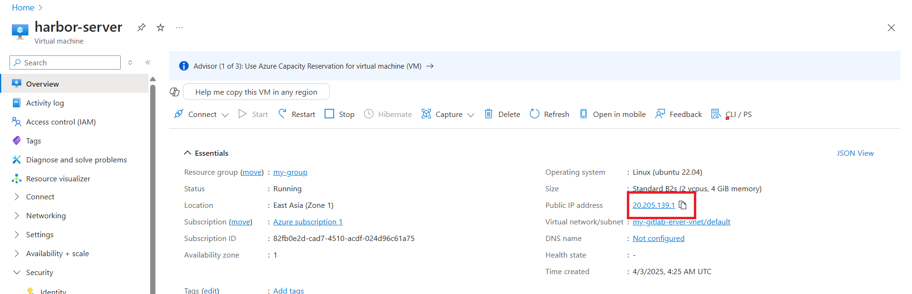
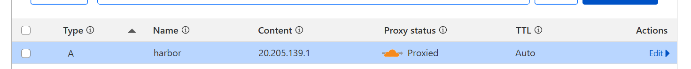
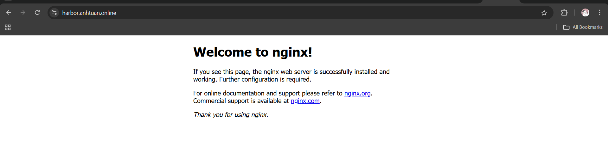
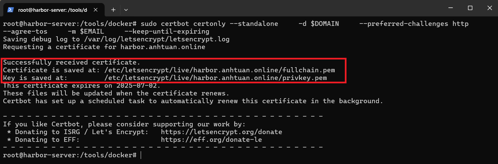
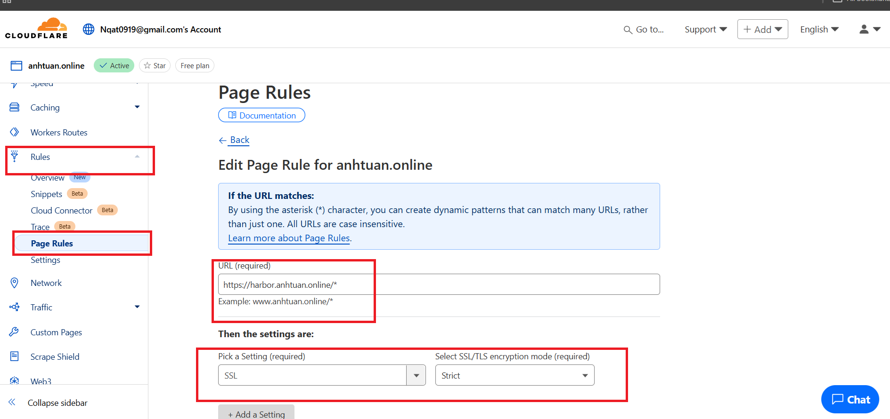
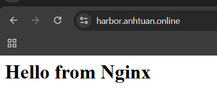

# SSL hoạt động như thế nào



**TLS** dùng **public key** và **private key** nó hoạt động qua các bước:
- Trình duyệt gửi yêu cầu một phiên làm việc an toàn tới máy chủ.
- Máy trả về một chứng chỉ, chứng chỉ này có chứa public key của server, chứng chỉ này phát sinh bởi server và trên server có chứa private key nữa (private key không được gửi tới trình duyệt).
- Trình duyệt cần ký nhận chứng chỉ, nó tạo ra yêu cầu tới **CA (Certificate Authority)** để chứng thực chứng chỉ.
- Trình duyệt và máy chủ trao đổi một số thông tin để kiểm tra các key.
- Trình duyệt và Server bắt đầu trao đổi dữ liệu được mã hóa TLS.


# Những điều cần biết trước khi sử dụng SSL
- Khi sử dụng SSL, website của bạn sẽ sử dụng giao thức HTTPS với đường dẫn có ổ khóa màu xanh.
- Website sẽ tải chậm hơn nếu cài Full SSL, vì nó phải mã hóa khi nhận/gửi dữ liệu.
- Nếu sử dụng Full SSL, khi chuyển host phải cài lại.

# Chi tiết về các loại SSL của CloudFlare
Với việc sử dụng Cloudflare làm proxy trung gian, chúng ta có thể có chứng chỉ SSL hay nói cách khác là giao thức HTTPS cho máy chủ một cách rất dễ dàng, cụ thể:
thì khi người khác truy cập vào tên miền của chúng ta với `https://`, kết nối sẽ được mã hóa bằng SSL thông qua Cloudflare mà không cần phải cài đặt SSL trên máy chủ:

**Quy trình hoạt động như sau**:
- Chúng ta thêm tên miền vào Cloudflare và cấu hình DNS.
- Bật Proxy (đám mây màu cam) cho bản ghi.
- Cloudflare sẽ cung cấp chứng chỉ SSL miễn phí và mã hóa kết nối từ trình duyệt đến Cloudflare.
  - Nếu là **Flexible SSL**, thì nhiêu đây là đủ, chúng ta không cần mã hóa kết nối giữa Cloudflare và server.
  - Nếu là **Full SSL** hoặc **Strict Full SSL** thì sẽ phải mã hóa thêm cả phía máy chủ và Cloudflare.

**Cụ thể, các chế độ SSL của Cloudflare như sau**:
- Flexible SSL:
  - Cloudflare mã hóa kết nối từ trình duyệt → Cloudflare (HTTPS), nhưng giữa Cloudflare → server là HTTP.
  - Không yêu cầu chứng chỉ SSL trên máy chủ. Tuy nhiên, kết nối giữa Cloudflare và máy chủ sẽ không được mã hóa và không bảo mật.
- Full SSL:
  - Kết nối từ trình duyệt → Cloudflare → server sẽ được mã hóa (HTTPS).
  - Cần chứng chỉ SSL trên máy chủ của chúng ta, nhưng chứng chỉ có thể là self-signed (tự ký), tức là không cần phải mua chứng chỉ từ một nhà cung cấp.
- Full SSL Strict:
  - Kết nối từ trình duyệt → Cloudflare → server đều được mã hóa (HTTPS).
  - Cần chứng chỉ SSL hợp lệ trên máy chủ (chứng chỉ từ một CA đáng tin cậy, ví dụ như Let's Encrypt).

# Sử Dụng Cloudflare DNS API Để Cập Nhật Địa Chỉ IP
Trong trường hợp bạn sử dụng một máy chủ với địa chỉ IP động (địa chỉ IP thay đổi liên tục, ví dụ khi bạn sử dụng mạng di động hoặc thay đổi vị trí), bạn có thể sử dụng Cloudflare DNS API để tự động cập nhật bản ghi DNS và đảm bảo rằng tên miền của bạn luôn trỏ đúng đến địa chỉ IP mới nhất của máy chủ.

**Quy trình hoạt động như sau**:

1. Lấy API Token từ Cloudflare:
   - Đăng nhập vào Cloudflare Dashboard.
   - Vào User Profile và tạo một API Token có quyền sửa đổi bản ghi DNS của tên miền (zone)
   - Chọn quyền `Zone.DNS` và `Zone.Zone` cho token này.
2. Cài Đặt DNS Record (A Record)
3. Viết script gọi đến Cloudflare DNS API để cập nhật lại bản ghi mỗi khi tên miền thay đổi.

# Lấy Full SSL Strict trên Cloudflare với Certbot

Như đã đề cập, chúng ta biết rằng Cloudflare sẽ tự động quản lý SSL cho truy cập từ internet -> Clouflare, cho nên để lấy được Full SSL thì chúng ta sẽ cần có thêm chứng chỉ cho kết giữa Cloudflare -> server.

Để làm được điều này, chúng ta sẽ sử dụng đến Certbot để lấy chứng chỉ miễn phí của Let's Encrypt.

## Certbot là gì

Certbot là một công cụ miễn phí giúp bạn tự động tạo và gia hạn chứng chỉ SSL từ Let's Encrypt. Nó giúp bạn dễ dàng bật HTTPS trên máy chủ của mình mà không cần mua chứng chỉ SSL từ các nhà cung cấp khác.

### Tại sao dùng Certbot?

- **Miễn phí**: Lấy chứng chỉ SSL từ Let's Encrypt mà không mất phí.
- **Tự động**: Cài đặt và gia hạn chứng chỉ SSL chỉ với vài lệnh.

### Cách mà Certbot sẽ hoạt động
1. Gửi yêu cầu cấp chứng chỉ đến Let's Encrypt.
2. Chứng minh quyền sở hữu tên miền (thường bằng cách tạo một file xác minh trên web server hoặc cập nhật DNS).
3. Nhận chứng chỉ SSL và tự động cấu hình máy chủ (Apache, Nginx,...).
4. Tự động gia hạn trước khi chứng chỉ hết hạn (Let's Encrypt cấp chứng chỉ có thời hạn 90 ngày).

### Cách đăng ký chứng chỉ SSL Full Strict với Clouflare và Certbot

Yêu cầu cần có:
- Một VPS có public IP (dynamic hoặc tĩnh) đã mở port 80 và 443 để cho phép kết nối từ internet.
- Hoặc một máy ảo / máy thật đã NAT port để cho phép truy cập được từ public IP của ISP.
- Một tên miền trên cloudflare.

Đầu tiên chúng ta tạo một VPS có địa chỉ public IP nào đó, trong trường hợp này là một VPS có địa chỉ 20.205.139.1



Tiếp theo, đăng ký một A record trên Cloudflare trỏ đến địa chỉ IP này



Xác nhận là A Record đã hoạt động



Như ta thấy thì Cloudflare **tự động cấp chứng chỉ SSL miễn phí** cho kết nối từ Client -> Cloudflare, chứ thực chất kết nối từ Cloudflare -> Server vẫn đang dùng HTTP nhé.

Tiếp theo, cài thêm Certbot để nó lấy chứng chỉ SSL từ Let's Encrypt:

```shell
sudo snap install --classic certbot
```

Sau khi cài đặt xong, thực hiện các câu lệnh sau để Certbot lấy chứng chỉ (đảm bảo là không có process nào đang chiếm dụng port 80)

```shell
export DOMAIN=harbor.anhtuan.online
export EMAIL=nqat0919@gmail.com
sudo certbot certonly --standalone \
    -d $DOMAIN \
    --preferred-challenges http \
    --agree-tos \
    -m $EMAIL \
    --keep-until-expiring
```

Khi xác nhận chứng chỉ thành công, chúng ta được 2 file như sau:



- **fullchain.pem**: 
  - Chứa chứng chỉ SSL của domain.
  - File này giúp trình duyệt và client xác thực rằng chứng chỉ do một tổ chức đáng tin cậy cấp.
  - Dùng để cấu hình cho web server.

- **privkey.pem**:
  - Là private key để server sử dụng trong quá trình mã hóa SSL.
  - Chỉ có server mới được giữ file này, **tuyệt đối không chia sẻ ra ngoài**.
  - Dùng để kết hợp với **fullchain.pem** để xác minh danh tính server.

Ví dụ server đang được serve bằng nginx, vào **/etc/nginx/nginx.conf** cấu hình như sau:

```shell
echo "<h1>Hello from Nginx</h1>" | sudo tee /var/www/html/index.html
sudo nano /etc/nginx/sites-availabled/anhtuan.online.conf
```

```shell
server {
    listen 80;
    listen [::]:80;
    server_name harbor.anhtuan.online;
    return 301 https://$host$request_uri;
}

server {
    listen 443 ssl;
    listen [::]:443 ssl;
    server_name harbor.anhtuan.online;

    ssl_certificate /etc/letsencrypt/live/harbor.anhtuan.online/fullchain.pem;
    ssl_certificate_key /etc/letsencrypt/live/harbor.anhtuan.online/privkey.pem;

    location / {  
        root /var/www/html;
        index index.html index.htm;
    }
}
```

Tiếp theo, chúng ta lên Cloudflare, tạo một Page Rule bắt buộc SSL cho domain như sau:



Sau đó restart lại dịch vụ nginx rồi thử truy cập với domain https://harbor.anhtuan.online/, nếu serve thành công nghĩa là chúng ta đã có SSL Full Strict hai đầu!

